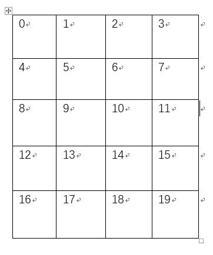
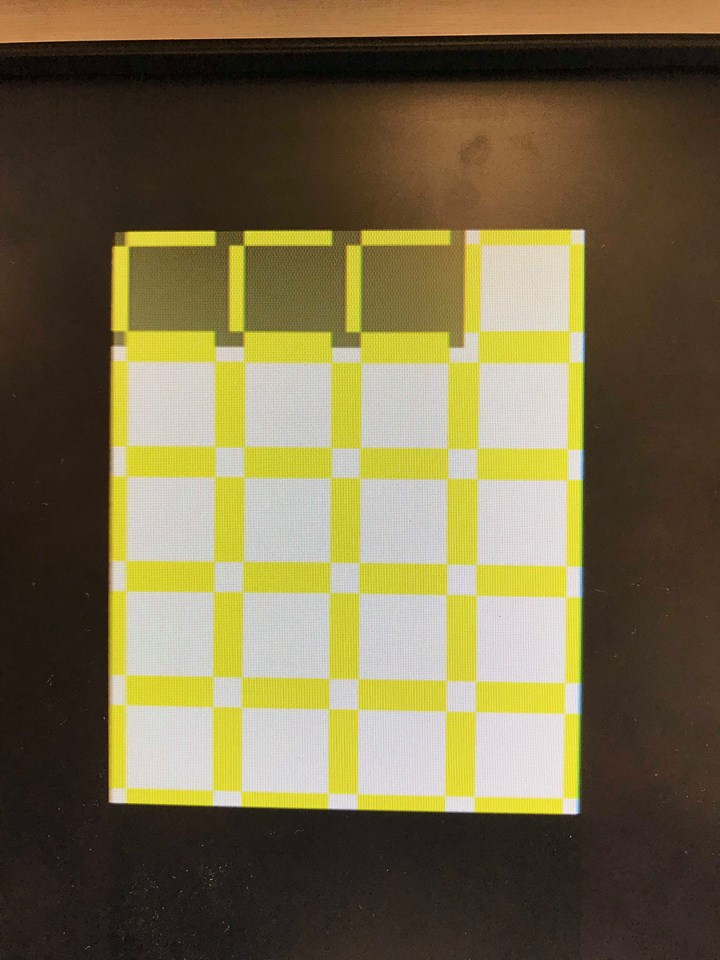

[To Home Page](../index.md)

[To Final Report Page](./FinalReport.md)

### Drawing the Maze

##### Introduction

The course required us to use an FPGA and Verilog to output a visualization of the maze to a display over a VGA connection. A VGA signal can be viewed as a 640 by 480 pixel space where each pixel is sent in order. This order starts with the upper-left pixel and scans horizontally until the end of line, where it jumps back to the left side on the line below. These scans are performed with specific timings and a few sync connections while the color is transmitted over separate analog RGB data. Luckily Verilog code for doing this on the FPGA was provided so we could just focusing on writing code that converted the requested X and Y pixel data into the correct color.

We recognized that the maze is a 5x4 array of identical cells and used this to divide our code into two parts: the decoder and the render. The decoder's function was to convert the requested X and Y pixel and localize it into which maze cell it belonged too or whether it was in the background. The localization process was to extract the relevant map data and shift the global X and Y positions into those relative to the upper right corner of the cell to be displayed. This allowed us to use a single cell renderer to display the entire maze. The render's job was to use the map data and the relative decoder and decide which color to output.


##### Decoder

```verilog
if(X >= (`X_SIZE*10'd0 + `X_OFFSET) && X < (`X_SIZE*(10'd0+10'd1) + `X_OFFSET) && Y >= (`Y_SIZE*10'd0 + `Y_OFFSET) && Y < (`Y_SIZE*(10'd0+10'd1) + `Y_OFFSET))
		begin 
			XOFF <= (`X_SIZE*10'd0 + `X_OFFSET);
			YOFF <= (`Y_SIZE*10'd0 + `Y_OFFSET);
			CELL <= MAP[7:0];
			if(rpos == 5'b00000)
				RBT <= {roth,5'b11111};
			else
				RBT <= {roth,5'b00000};
				
		end
…
else
		begin
			XOFF <= 10'b1111111111;
			YOFF <= 10'b1111111111;
			CELL <= 8'b00000000;
			RBT <= 8'b00000000;
		end
	end
	
endmodule
```

Figure 1: Truncated version of the decoder code.


The maze was visualized as 5x4 cells that were dimensions X_SIZE and Y_SIZE and the entire maze was offset from the corner by X_OFFSET and Y_OFFSET. This allowed us to center the maze on the screen easily and scale the X and Y dimensions to get relatively square cells. This was important as the displays typically displayed equal dimensions as rectangles since the pixels were rectangles not squares.

It then passes the current requested X and Y pixel data through as cascade of if-else statements to find within which cells extents the pixel is in. If it wasn't in a cell than the output variables were set to sentinel values to indicate such. Otherwise, once the current cell was found, the offset outputs would be set to the current pixels upper left corner so relative coordinates can be used in the renderer. Additionally, the current map data would be placed in the CELL output byte and the robot position would be tested to see if the robot should be rendered in the current cell. All of these outputs were the inputs to the cell renderer.


##### Renderer

```verilog
always @ (posedge CLK)
	begin
		if(XOFF == 10'b1111111111 && YOFF == 10'b1111111111)
		begin
			COL <= `BLACK;
		end
		else if(xrel >= 0 && xrel < `X_SIZE && yrel >= 0 && yrel < `Y_SIZE)
		begin
			...
             ...
			// north wall
			else if(xrel >= `W_WALL && xrel < `X_SIZE-`E_WALL && yrel >= `ZERO && yrel < `N_WALL && NORTH)
				COL <= `COL_WALL;
          ...
		 ...	
			// background color
			else
				if(TREASURE == 2'b01)
					COL <= `RED;
				else if(TREASURE == 2'b10)
					COL <= `GREEN;
				else if(TREASURE == 2'b11)
					COL <= `BLUE;
				else if(COLOR == 2'b01)
					COL <= `COL_VIS;
				else if(rcnd)
					COL <= `COL_RBT;
				else
					COL <= `WHITE;
		end
		else
			COL <= `COL_UNDF;
	end
endmodule
```

Figure 2: A listing of the truncated renderer code.


The render takes the input data and provides a one to one mapping of relative pixel to an output color without any double counting. First if the offset values were set to the sentinel values then the background color BLACK was used to fill in the empty space. Else, if the requested pixel was inside the cell dimension then the color would be mapped according to the map data otherwise it would be set to an undefined marker color to indicate an error.

The renderer would first test if the pixel belonged to any feature such as a wall and if the wall was to be rendered then the color would be set to the wall color. Otherwise the color would be set to a background color RED, GREEN or BLUE if there was a treasure and special colors to indicate that the robot was currently in the cell or that the robot had previously visited the cell, these were useful for algorithm testing purposes. Finally, if the cell had no special background then a default of white was used.

##### Connection 
We design the data format with 168 bits to display the maze according to the data transmitted from the arduino. 
The most significant byte is the information of the robot.
The rest 20 bytes represents 20 cell in the maze, we number them in Decoder using rpos, the order is shown in diagram below, the lowest byte represents information of the cell0, and so on.

 

Figure 3: Number of cells

Arduino sent the data byte by byte, according to our data formate, we need 21 bytes to display the maze. Arduino sent the data byte by byte, to track the order of data, we set a index to record the byte coming from arduino. 

```verilog
	always @ (posedge ss)  begin
 		if(reset) 	
 			map_counter <= 25'b0;
			map_counter <= map_counter + 1;
    	if(map_counter==25'd20)
    		map_counter <= 25'b0;//back to 0
    ...
```
Then we put the 1-byte data recieved in its corresponding position in the 21 byte data

```verilog
    ...
        else if(map_counter==25'd0) 
			MAP[7:0] <=  map_part[1];
		else if(map_counter==25'd1) 
			MAP[15:8] <=  map_part[2];
		...
		else if(map_counter==25'd20) 
			MAP[167:160] <=  map_part[0];
		else MAP <= MAP;	
	end		
```	 

To check whether the code works, we hardcode the map_part, turns out it can display maze normally. 


Figure 4: test displaying 

##### Video of operation

*The following is a vedio of the Render coder running on test data:*

<iframe width="560" height="315" src="https://www.youtube.com/embed/wSyzOmto8Sg" frameborder="0" gesture="media" allowfullscreen></iframe>

[To Final Report Page](./FinalReport.md)

[To Home Page](../index.md)