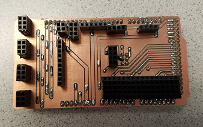
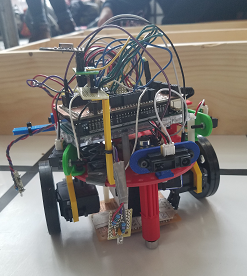

[To Home Page](../index.md)

# Final Report

## Introduction 

The goal of this project was to build an intelligent physical system that could traverse a maze independently by perceiving and acting upon its environment. Our final design intended to:

* Begin on a 660 Hz tone
* Follow a grid of black lines through the maze a grid consisting of black lines
* Detect walls and IR frequency beacons (treasures)
* Display and map the maze as it progresses 
* Send a “done” signal to indicate that the robot has finished traversing the maze

Our robot, unfortunately, did not meet all the requirements of the final competition, but he sure tried really hard. He also looks the part. We are proud of it, our robo son. While he stubbornly refused to use SPI to map the maze, he was adequate in wall detection, treasure detection, and maze traversal. 

## Competition

Here is a video of our pride and joy during the competition, featuring Thinesiya’s hair at some point:

<iframe width="560" height="315" src="https://www.youtube.com/embed/aayaG6dnSNM" frameborder="0" gesture="media" allow="encrypted-media" allowfullscreen></iframe>

Our boy never stops working. Literally. He doesn’t stop. But nonetheless, it was a wholesome learning experience in which we learned about hardware, software, & mental wear and tear due to our superb, marvelous communication skills. We like to think we grew as a team and as individuals thanks to this semester-long team project.

### Robot
We used an Arduino Mega for our robot becasue it allowed us to have more pinouts and enough memory. We even had a nice sheild for the Mega which was print in the Maker Lab:

  

The two features that we added were: 

* [Start Tone](./StartTone.md)
* [Treasure Detection](./TreasureDetection.md)

#### Improvements to Navigation Algorithm
We improved upon the algorithm by adding the capability for the robot to keep track of the position it has visited.  Which we were able to do by keeping track of the robot’s orientation.  We also added four wall sensors to the robot so that it can transmit its environment from all directions back to the base station. We used the crosssections as indicators where the robot would decide on where to go as well as the transmit it packets. Here is a vedio of the test run where the robot stops when it has traversed the maze.:

<iframe width="560" height="315" src="https://www.youtube.com/embed/5ZV0g7oCqXc" frameborder="0" gesture="media" allow="encrypted-media" allowfullscreen></iframe> 

Here is the link to the full length [code](./NavigationAlgo.md)

### Communication and Base Station

* [Radio Communication](./RadioCommunication.md)
* [SPI](./Spi.md)
* [Map Drawing](./DrawingtheMaze.md)

### Final Product
We all learned a lot about integrating all parts of ECE to great this final product and we greatly thank all the wonerful TA's that helped is every step the way.  Thank you Professor Petersen for also encouraging us to work as a team to accomplish our goals.  Although we didn't prefrom as well during competition and there are many improvements we can make to optimize our robot, we are very proud the way our little guy turned out. Thank You for an Awesome Semester!

### Work Distribution For the Report/Final Product
We all helped each other, especially when integrating the components. But we split the work as follows amongst ourselves based on people coming to lab for component wise testing:
* Introduction: Stephanie
* Improvements to Navigation Algorithm & Start Tone: Thinesiya 
* Treasure Detection: Peter
* Radio Communication: Stephanie
* SPI: Alan & Yijia
* Map Drawing: Peter & Alan & Yijia
* Final Product & Formating Website: Thinesiya  

[To Home Page](../index.md)
