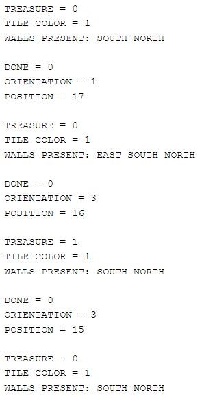
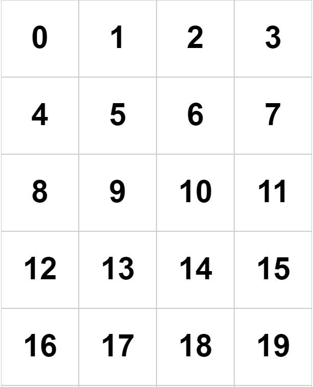

[To Home Page](/index.md)

[To Control Page](./control.md)

### Radio Communication

To communicate between robot and base station, we wrote code for the Arduino to send two packets containing necessary information. From the robot, we transmit two packets of information, each containing 8bits. The packets are formatted as follows:

*Type 1*


*Type 2*


Packet type #1 tells us whether the robot has traversed the entire maze, which direction it is facing, and which cell it is in. The cells are numbered from 0 to 19, and the starting point is always cell 19. 


Packet type #2 relays detection information, including the type of treasure present (if any), if we are currently occupying a cell (so that we can color it in on the FPGA), and which sides have contain walls. 


These two packets are transmitted every time the robot reaches another cross-section and performs another check of its surroundings. 


The base station receives this information and packs it all into a 21-element array. This keeps track of the status of every cell so that the FPGA can redraw the map as appropriate. In this array, the first 20 elements are records of packet type #2. The final element is an updated version of packet type #1. By using the position bits from packet #1 as an index for the array, the base station recorded and updated the information for that particular cell with the 8-bit unsigned char sent in packet #2. The following radio receiving code from the base station performs this process:


##### *NOTE: 
The variables ind_done, rob_orien, rob_pos, treas, tile_clr, and wall are unsigned chars meant to hold the values encoded to packets #1 and #2 once they have been unpacked again. counter is a counter so that we can differentiate between the two packets. Finally, mapPacks[] is the array in which we store the cell information. We also printed statements to tell us the information, but it is cut here for length.*

```c
if ( role == role_pong_back )
  {
    // if there is data ready
    if ( radio.available() )
    {
      unsigned char got_data;
      radio.read(&got_data, sizeof(unsigned char) );

      //packet type 1: done/orientation/position
      if (counter % 2 == 0) {
        ind_done = (got_data & 128) >> 7;
        rob_orien = (got_data & 96) >> 5;
        rob_pos = got_data & 31;
        mapPacks[20] = got_data;
        
   //print done signal
        if (ind_done == 1) {
          printf("\nDONE!!!!!!! Congratulations!n\n");
        }
      }

      //packet type 2: treasure/color/walls
      else {
        mapPacks[rob_pos] = got_data;
        treas = (got_data & 192) >> 6;
        tile_clr = (got_data & 48) >> 4;
        wall = got_data & 15;
          }
      counter = counter + 1;

      // Delay just a little bit to let the other unit
      // make the transition to receiver
      delay(20);

    }


// packet 20
// indicator(DONE) = 0 | Orientation (N/S/E/W) | Position (0-19, start is always at 19)
// 1 bit | 2 bits | 5 bits
// packet 19-0
// treasure(7Hz,12Hz,17Hz)| color | wall(W/E/S/N)
// 2 bit | 2 bits | 4 bits
```

Once we ran the code, we received these updates on the serial monitor of the base station telling us where the robot was, which walls were present, and which treasures were detected.

 

Figure 1: Serial monitor output from base station. A treasure is detected at position 16.



Figure 2: Cell numbering for the maze. The robot always starts in position 19, facing North.


[To Control Page](./control.md)

[To Home Page](/index.md)