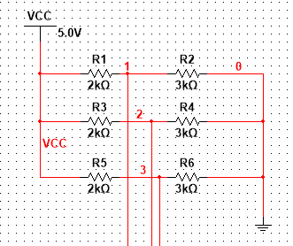

[To Home Page](../index.md)

[To Final Report Page](./FinalReport.md)

### SPI:Communication between Arduino and FPGA board on the base station

After the base station Arduino receives the position data of the robot and the color data of the maze, it would transmit those data to the FPGA for VGA maze drawing. We use Serial Peripheral Interface (SPI) Bus for this task.

As mentioned in the Radio section, the whole packet is consisted of 21 bytes, where the first 20 bytes store the color information of each cells in maze, and the last byte stores the moving information of the robot to help the program modifying the first 20 bytes information based on the robot's movement.

Hence for SPI data transmission, we are using an exhaustive transmitting method to transmit all the 21 bytes of the packet everytime the robot hits a new crossline.

##### SPI circuit buildup
Arduino -> voltage divider  -> FPGA
sck (ICSP pin)			 GPIO_0_D[31]
mosi (ICSP pin)		 GPIO_0_D[29]
ss (pin 4)			 GPIO_0_D[33]


Figure 1: Circuit buildup 


Figure 2: Voltage divider

##### Software code implementation

######  Arduino (sending)
The code below shows the function we wrote for transmitting a byte from arduino (master) to fpga (slave). value represents one byte of the maze/robot information we are sending.
```c
#include "SPI.h" // necessary library
int ss=10; // using digital pin 10 for SPI slave select
void setup()
{
  pinMode(ss, OUTPUT); // we use this for SS pin
  SPI.begin(); // wake up the SPI bus.
  SPI.setBitOrder(LSBFIRST);	// least significant bit first order
}

void setValue(int value)
{
  digitalWrite(ss, LOW); // set the ss to low, start transmitting a byte
  SPI.transfer(value); // send a byte (value from 0 to 255)
  digitalWrite(ss, HIGH); // set the ss back to high, end transmission
}

void loop()
{
  // sending the 21 byte packets that represent all the maze/robot       
  // information.   
}
```

######  FPGA (receiving)

The code below shows the function we wrote for receiving packet from arduino (master) at fpga (slave). data_receive represents one byte of the maze/robot information we are sending; map_part represents the whole packet value of 21 bytes for the maze's information.

```verilog
assign ss = GPIO_0_D[33];
assign arduino_clk = GPIO_0_D[31];
initial begin
	 idx = 0;	// bit index for each byte received (0~7)
	 idx2 = 0;        // byte index for each packet received (0~20)
	 end
	 
	 
	 always @ (posedge arduino_clk) begin
	     data[idx] <= GPIO_0_D[29];	// receive one bit of a byte per SPI clock cycle
		  if(idx<=6)			// increment or reset the index of the byte
		  idx <= idx + 1;
		  else idx<=0;
		  
	 end
	 
	 always @ (posedge ss) begin
	 
	     data_receive <= data;	// A byte of 8 bits has been received
                 map_part[idx2] <= data_receive;	     // store this byte into the packet
                 if(idx2 <= 19) begin	// increment or reset the index of the packet
	         idx2 <= idx2 + 1;
                 end
	     else idx2 <= 0;
```

##### Issue incurred during final competition
Unfortunately, both the radio and base station's Arduino-to-FPGA communication modules involves using SPI for transmitting the data. They are using SPI separately and the setup function of these two modules (SPI.begin() and radio.begin()) would not work compatibly, and during the final competition, we could only guarantee that one of them works.

Two ways to solve this problem in future:

1. Manually setup and deactivate the Arduino-to-FPGA communication and radio modules on the SPI everytime we need to toggle from one module to the other (A brutal-force method). 

2. Try to combine the two modules into one SPI systems with common member functions for setup and deactivation. Use two different chip select pins to select which module is working now.

##### SPI Test case video
Below is a video showing the FPGA is receiving data incrementing from 0 to 255 from Arduino:

<iframe width="560" height="315" src="https://www.youtube.com/embed/5ZV0g7oCqXc" frameborder="0" gesture="media" allow="encrypted-media" allowfullscreen></iframe>


[To Final Report Page](./FinalReport.md)
[To Home Page](../index.md)