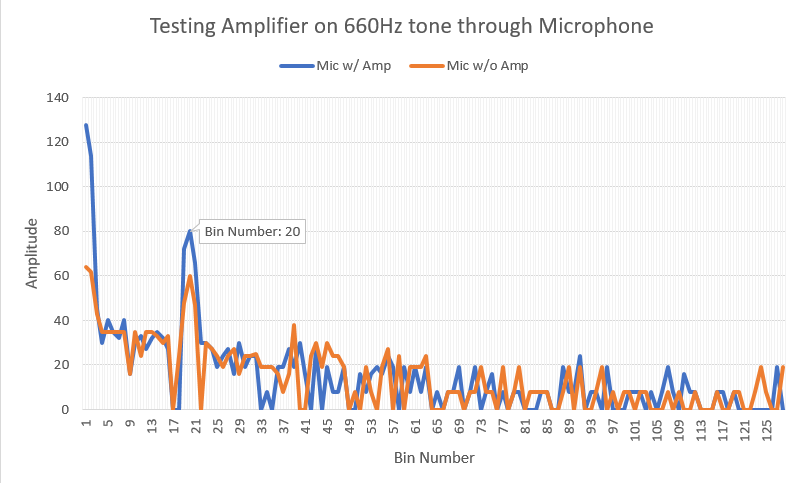

[To Home Page](../index.md)

[To Final Report Page](./FinalReport.md)

## Previous Work 
The first requirement the competition is to have the robot start navigating the maze when a 660Hz tone is played from speakers near the robot.  We used a [MAX4466]( https://www.adafruit.com/product/1063) Microphone with adjustable gain, which we used in Lab2.  During Lab2, we learned how to use the Arduino FFT library, which gives us the ability to identify the frequency of the tone based on the value found in a certain bin.  In our case 660 Hz gave us a spike in bin 20.  The microphone we used had an adjustable gain, which we set to the maximum value and ran the FFT script again and tested what distance the speakers needed to be for the Arduino to be able to pick up the 660Hz signal, which was only a few inches.  We decided to build an amplifier, which would help increase the signal so that the Arduino will be able to pick it up form a greater distance.

## Amplifier
### Design
We designed the amplifier based on the following schematic shown in Figure 1 below.

   

Figure 1: Amplifier Circuit for Microphone

### Implementation 
We first built the amplifier circuit on a bread board and tested it to make sure it gave us the gain we wanted, which the gain was to low we replaced R4 with a higher resistor.  After we had some confidence that the amplifier circuit worked we soldered it onto a perf-board, as shown in Figure 2.

   

Figure 2: The picture includes our amplifier as well as the push button circuit that served as a failsafe to start our robot.

### Component Testing 
We then tested the soldered board intensively!  First, we replaced the board with a signal generator and tested it by plotting it out on an oscilloscope. The screen shot of the oscilloscope is provided below in Figure 3.

Figure 3: You can see the increase in amplitude that the circuit provides.  Channel 1 is input and Channel 2 is output.

We then removed the signal generator with a microphone and played a 660Hz tone from our phones and plotted the results on the oscilloscope.  The screen shot of the oscilloscope is provided below in Figure 4.

Figure 4: You can see the increase in amplitude that the circuit provides.  Channel 1 is input and Channel 2 is output.

We then ran the FFT script from Lab 2 on with the Mircophone alone and with the Microphone and the Amplifier to determine the bin number.  Figure 5 shows the comparison of the two setups and the bin number that the 660Hz appears in.

Figure 5:  The amplified signal is shown in blue while the orange is the output signal from the microphone, without the amplifier.
 
### Integration 
After determining the bin number and threshold value we added it to our full Arduino code, which waited to run our navigation code until the 660Hz tone was heard or the failsafe button was pressed.  

[To Final Report Page](./FinalReport.md)
[To Home Page](../index.md)