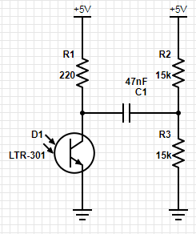
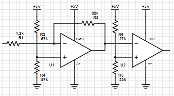
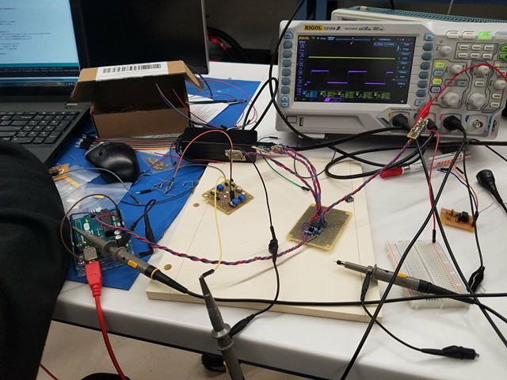

[To Home Page](../index.md)

[To Control Page](./control.md)

### Treasure Detection

##### Part 1: Building the Circuit



Figure 1: The IR treasure detector circuit.


The treasures are infrared (IR) LEDs that pulse at either 7 kHz, 12 kHz or 17 kHz. To detect the IR emissions we used the LTR-301 which is an NPN IR phototransistor, the circuit we designed for this is shown in Figure 1. R1 provides the IR phototransistor with the required bias current. The output signal of R1 and D1 is an the weak treasure modulation superimposed on to a DC bias. This DC bias is very sensitive to the exact value of R1 and the condition of the sensor D1 and is an unreliable value. To fix this, we decided to add C1, R2 and R3 which serves two purposes: a high pass filter and a voltage divider. The high pass filter needs to have a cutoff frequency well below the lowest treasure frequency and additionally R2 and R3 should have equal value to create a DC bias in the middle of the supply voltage. Using these constraints we selected component values that were available. As designed the high pass filter has a cutoff frequency of 450 Hz which is an order of magnitude below the lowest treasure frequency.




Figure 2: The amplifier circuit.


Now that we had one sensor designed and built the next step was to duplicate the circuit and build three more so that our robot could detect treasures in front, behind and on the left and right sides. Since the robot doesn't need to detect which direction the treasure is in, these four circuits were wired in parallel to combine their outputs into one signal for simplicity. This signal was then used as the input to the circuit in Figure 2.

U1 and U2 are the two opamps in the LF 353 where U1 is used as an inverting amplifier and U2 is a comparator. R2 and R1 set the voltage gain  to about 70 which amplifies the weak treasure signal. R3 and R4 provide a mid range voltage level to remove the DC offset created in the treasure circuit. The output signal is then fed into a comparator circuit with a threshold set by R5 and R6. This threshold was set just above the midrail voltage with the difference divided by the amplifier gain is the treasure detection threshold. The output of the comparator is a square wave at the frequency of the treasure, this was then connected to one of the arduino's digital inputs.




Figure 3: Testing the treasure circuits and amplifier. The output of the comparator is the purple trace on the oscilloscope.


##### Part 2: Programming the Arduino

```c
// Pin that the treasure circuit is connected too
#define TREASURE_PIN 7

void treasure_init(){
  // make the treasure pin an input
  pinMode(TREASURE_PIN, INPUT);
}

float treasure_frequency(){
  // measure both high and low pulses to get the actual pulse width
  unsigned long ph = pulseIn(TREASURE_PIN,HIGH);
  unsigned long pl = pulseIn(TREASURE_PIN,LOW);

  // collect a total of four periods
  ph += pulseIn(TREASURE_PIN,HIGH);
  pl += pulseIn(TREASURE_PIN,LOW);
  ph += pulseIn(TREASURE_PIN,HIGH);
  pl += pulseIn(TREASURE_PIN,LOW);
  ph += pulseIn(TREASURE_PIN,HIGH);
  pl += pulseIn(TREASURE_PIN,LOW);

  // divide the count by four, the number of samples collected
  ph = ph>>2;
  pl = pl>>2;

  // the sum is the period and each integer value is 1us thus the 1e-6
  float period = (ph+pl)*1.0e-6;

  // frequency is one over period
  float frequency = 1.0/period;

  return frequency;
}
```

Figure 4: The arduino code for treasure detection.


The main design choice for this revision of the treasure detection was to avoid using an analog input and the FFT library. We found that they just took up to much memory and decided that this way was simpler and provided more intuitive results. The code is listed in Figure 4, the *treasure_frequency()* function measures four high pulses and four low pulses of the square waves to get an average value. The high and low averages were then summed to get the period of the treasure signal from which the frequency is calculated and returned.


[To Control Page](./control.md)

[To Home Page](../index.md)
