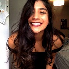
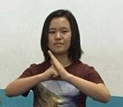
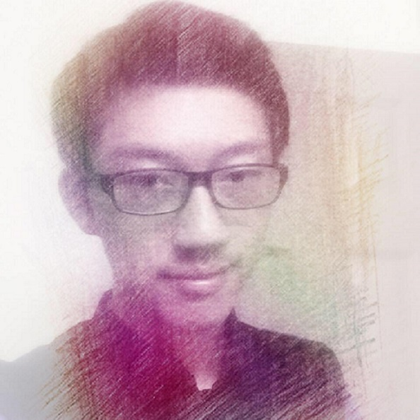
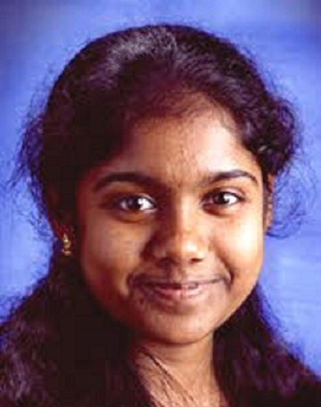
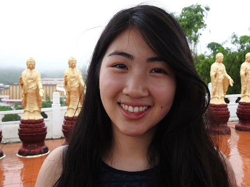

# Get to Know Us

## Mira A. Bhut (mab586) 

  

## Yijia Chen (yc2366)

I'm Yijia, from China, I like anything interesting. 

## Yirong Alan Cheng (yc2353)
 

I am a junior in ECE. I just transferred here from UIUC in Illinois. I am the member of the IEEE-HKN (an ECE honor society). My main interests are signal processing and multimedia. I used to play badminton and swim, but now become much more indoor-orientated. I love reading books about philosophy and history on the free time, and I am also a member of the drama club.

## Thinesiya Krishnthasan (tk455)

## Stephanie Lin (scl97)

A junior in ECE with a business minor. Hometown is the Windy City of Chicago. Likes to draw, learn languages, and drink bubble tea. Currently part of the Cornell Badminton Club with three State championship medals and will challenge anyone who dares, even a robot.

