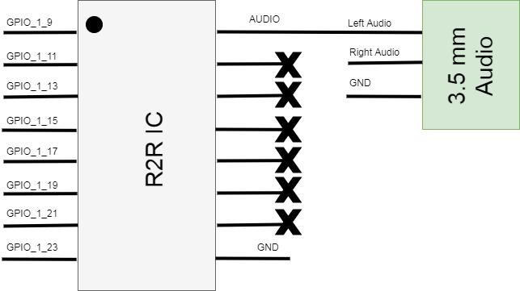
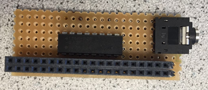
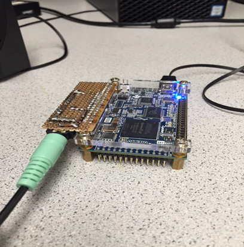
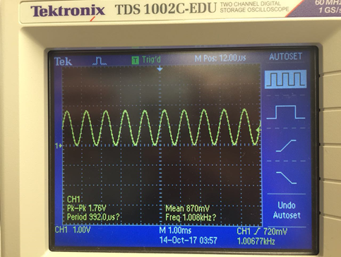
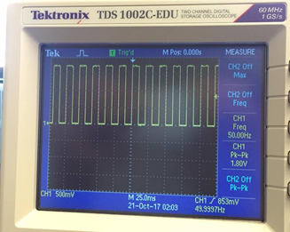

### Team Sound

Peter Slater, Mira Bhut, Yirong Alan

##### Part 1: Building the DAC


Figure 1: Resistor network of the 8-Bit R2R DAC, sourced from this [datasheet](https://www.bourns.com/pdfs/r2rap.pdf).


We started this lab by building a R2R Digital to Analog converter (DAC) to convert the digital FPGA outputs to an analog voltage audio signal. This circuit gets it's name because it is built from a resistor network composed of resistances R and 2R and is pictured in Figure 1. The 8-Bit R2R DAC is packaged in a 16-dip package that was user friendly and easy to solder.







Figure 2: The schematic of the finished 8-bit DAC Circuit (top), the soldered board (middle) and the board and FPGA assembly with speaker connected (bottom).

We built the circuit described in Figure 2 by soldering the components onto a piece of perf-board with a mating connector to the FPGA. We choose to use GPIO 1 since the display team was already using GPIO 0 for the VGA output and the specific pins were chosen because it was the only continuous GPIO section with a ground pin nearby. The board could then be plugged into the FPGA and the speaker can connect to the 3.5 mm audio jack.

##### Part 2: Creating a Sine Wave

We created our sound through a method known as direct digital synthesis (DDS). In this method, one period of a sine wave is sampled at discrete intervals, in our case 256, and each sample is output for that interval. To implement this we created a Verilog module SINE_LUT.v using Matlab code that would generate the samples, pack them into 8-Bit values, then write the Verilog module.

Matlab Code:

```matlab
clear all;

% frequency to sample
fo= 1e3;
% number of samples to collect
Nsamp = 256;
fs = Nsamp*fo;

% generate the sampled cos 
t = linspace(0,1/fo,Nsamp);
s = sampled_sin(t,fo,fs);
P = pack_samples(s,8);

subplot(2,1,1);
plot(s)
subplot(2,1,2);
stairs(P);

fid = fopen('./SINE_LUT.v', 'w');
verilog_sinLUT(fid,P);

function P = pack_samples(s, n)
    min_s = min(s);
    max_s = max(s);

    % Normalize Sample Data to [0:2^n - 1]
    s = (s - min_s) / (max_s - min_s) * (2.^n - 1);
    P = fix(s);
end

function verilog_sinLUT(fid, data)
    n = length(data);
    fprintf(fid, 'module SINE_ROM(input [%i:0] addr, input clk, output reg [7:0] q);\r\n', ceil(log2(n))-1);
    fprintf(fid, '\treg [7:0] sine[%i:0];\r\n', n-1);
    
    fprintf(fid, '\tinitial\r\n\tbegin\r\n');
    for i = 0:n-1
        fprintf(fid, '\t\tsine[%i] <= 8''b%s;\r\n', i,num2str(dec2bin(data(i+1),8)));
    end
    fprintf(fid, '\tend\r\n');
    
    fprintf(fid, '\talways @ (posedge clk)\r\n\tbegin\r\n');
    fprintf(fid, '\t\tq <= sine[addr];\r\n\tend\r\n');
    fprintf(fid, 'endmodule\r\n');
end
```

Verilog Code:

```verilog
module SINE_LUT(input [7:0] addr, input clk, output reg [7:0] q);
	reg [7:0] sine[255:0];
	initial
	begin
		sine[0] <= 8'b01111111 
// rest of the bits
		sine[255] <= 8'b01111111;
	end
	always @ (posedge clk)
	begin
		q <= sine[addr];
	end
endmodule

```

Sound is then created by instantiating this module in our main code and on every edge of the 25 MHz clock a variable *data_counter* is incremented and when this counter surpasses a threshold value (96) a new sample is read from the sine wave. The value of 96 was chosen because it would get us a frequency close to 1 kHz (25 MHz / 256 Samples / 96 = 1017 kHz) The code to do this is included below.

```verilog
always @ (posedge CLOCK_25) begin
  if (reset) begin
    data_state   <= 8'b0;
    data_counter <= 25'b0;           
  end

  if (data_counter == 96) begin
    data_state <= data_state + 8'b1;
    data_counter <= 25'b0;
  end

  else begin 	
    data_state   <= data_state;
    data_counter <= data_counter + 25'b1;
  end            	 
end
```



Figure 3: The output 1 kHz sine wave

The output of the DAC was measured with an oscilloscope and is displayed in Figure 3. The measured frequency is 1.00677 kHz which is very close to the designed 1 kHz frequency. We can also notice a small amount of stair stepping in the steep regions that is from the limited resolution of the 8 bit DAC. One problem that we noticed at this time is that the maximum amplitude of the signal was only about half of what was expected (3.3 V). We found that this error was caused by accidentally shorting out the left and right audio channels. This error was fixed in the final circuit by removing the short.

##### Part 3: Creating a Tune

The problem statement described a tune as a sequence of three tones. To create this we modified our sine wave from Part 2 by changing the threshold value (T). This had the effect of frequency modulating our sine wave output and can be used to create a tone. The math for this is: freq = 25 MHz / 256 Samples / T. In our case we chose three frequencies to play 1 kHz (96), 2 kHz (48), and 680 Hz (144). Each of these thresholds were sequenced by introducing a *count* variable into our that allow us to specify a period to play each tone. The code and a short video demoing the three tone being played are included below .

```verilog
localparam Freq1 = 96;
localparam Freq2 = 48;
localparam Freq3 = 144;

reg [24:0] count;
reg [24:0] data_counter;
reg [7:0] data_state;
wire [7:0] amplitude;

SINE_LUT sin(
  .addr (data_state),
  .clk (CLOCK_25),
  .q (amplitude)
);

always @ (posedge CLOCK_25) begin
  if (reset) begin
    data_state   <= 8'b00000000;
    data_counter <= 25'b0;
    count <= 25'b0;

  end

  if (0<=count && count<300000 && data_counter == Freq1) begin
    data_state   <= data_state + 8'b00000001;
    count <= count + 25'b1;
    data_counter <= 25'b0;
  end

  else if (300000<=count && count<900000 && data_counter == Freq2) begin
    data_state   <= data_state + 8'b00000001;
    count <= count + 25'b1;
    data_counter <= 25'b0;
  end

  else if (900000<=count && count<1100000 && led_counter == Freq3) begin
    data_state   <= data_state + 8'b00000001;
    count <= count + 25'b1;
    data_counter <= 25'b0;
  end

  else if (count == 1100000)
    count <= 25'b0;

  else begin 	
    data_state   <= data_state;
    data_counter <= data_counter + 25'b1;
  end // always @ (posedge CLOCK_25)

end
```

# VIDEO HERE


##### Part 4: Creating a Square Wave



Figure 4: The square wave output on the oscilloscope

It was at this time that we actually read the requirements for this lab and realize that we skipped a few steps. We were supposed to create a square wave before we created our tune so we hacked our code to create one. To do this we examined the generated sine table and found two entries that corresponded to all ones (64) and all zeros (188) and we then generated code that would alternate between these two entries. We generated a 50 Hz square wave by toggling every 250,000 clock cycles (25 MHz / 250000 /2) where the division of two occurs because one period of the square wave has two toggles. The output was verified on an oscilloscope and the the frequency was dead on at 49.99997 Hz. The code for this part is included below.

```verilog
// Basically we're using two values of the sine look up table (sin[64] & sin[188])
// to simulate the high and low level of the square wave. The detail about sine look-up
// table is in next section.

reg [24:0] data_counter; // timer
reg [7:0] data_state;   // the index of the sin_LUT
wire [7:0] amplitude;

// Sine LUT module
SINE_LUT sin(
  .addr(data_state),
  .clk(CLOCK_25),
  .q(amplitude)
);

always @ (posedge CLOCK_25) begin
  if (reset) begin
    data_state   <= 8'b01000000;
    data_counter <= 25'b0;                  	
  end

  if (data_counter == 250000) begin
    if(data_state == 8'b01000000)
      data_state <= 8'b10111100;
    else
      data_state <= 8'b01000000;

    data_counter <= 25'b0;
  end

  else begin 	
    data_state   <= data_state;
    data_counter <= data_counter + 25'b1;
  end            	 
end
```

