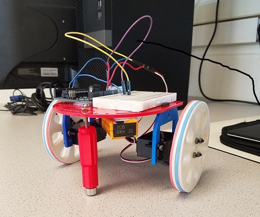

[To Home Page](./index.md)

# Lab 1: Microcontroller
### Objective: 
The objective of this lab was to familiarize ourselves with the Arduino Uno board and IDE. We utilized digital and analog outputs, digital outputs, and writing analog PWM outputs.

### Equipment:
* 1 Arduino Uno
* 1 solderless breadboard
* 1 USB A/B cable
* 1 LED 
* 2-3 resistors (kΩ range)
* 1 potentiometer
* 1 continuous rotation servo
* 1 pushbutton

## Part1: Modify the Blink Sketch
To learn about the input/output functionalities of the Uno board, we modified sample code from the blink program provided by Arduino to make an LED blink on and off every second.

```
void setup() {
    pinMode(LED_BUILTIN, OUTPUT);  // set signal to built-in LED
}

void loop() {
  digitalWrite(LED_BUILTIN, HIGH);  //toggle on
  delay(1000);                       
  digitalWrite(LED_BUILTIN, LOW);   //toggle off  
  delay(1000);                       
}
```
The code compiled and was sent to the Arduino board, which began to blink an LED embedded on the board as desired.

## Part2: The Serial Monitor and the Analog Pins
Utilizing the board’s digital writing capabilities, we set up an LED to digital output pin 12 on the Arduino board. Then we modified the code to send a signal to the LED. 

```
void setup() {
    pinMode(12, OUTPUT);  // set LED connection to pin 12
}

void loop() {
  digitalWrite(12, HIGH);	// toggle on
  delay(1000);                       
  digitalWrite(12, LOW);    // toggle off
  delay(1000);                       
}
```
The blue LED repeatedly toggled on and off with a time interval of one second in between. Here is a photo of the LED turned on.

* photo


## Part3: Analog Output

## Part4: Parallax Servos


```
#include <Servo.h>
Servo servoL;
Servo servoR;

void setup() {
  Serial.begin(9600);
  servoL.attach(10); 
  servoR.attach(11);
}

void loop() {
  // move forward for 2 seconds
  servoL.write(60); 
  servoR.write(120);
  delay(2000);
  
  // pause for 1 second
  servoL.detach(); 
  servoR.detach();
  delay(1000);
  
  // move backward for 2 seconds
  servoL.attach(10); 
  servoR.attach(11);
  servoL.write(120);
  servoR.write(60);
  delay(2000);
  
  // pause for 1 second
  servoL.detach(); 
  servoR.detach();
  delay(1000);
  
  servoL.attach(10); 
  servoR.attach(11);
}
```


## Part5: Assemble and Run Your Robot
Our assembled robot:



Watch our robot move back and forth:

<iframe width="560" height="315" src="https://www.youtube.com/embed/Do-kx_vWezc" frameborder="0" allowfullscreen></iframe>

[To Home Page](./index.md)


