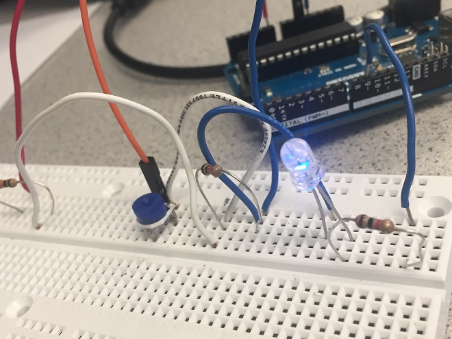
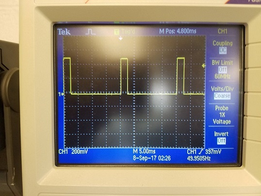
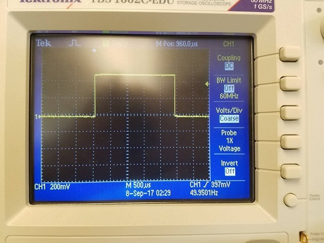

[To Home Page](./index.md)

# Lab 1: Microcontroller
### Objective: 
The objective of this lab was to familiarize ourselves with the Arduino Uno board and IDE. We utilized digital and analog outputs, digital outputs, and writing analog PWM outputs.

### Equipment:
* 1 Arduino Uno
* 1 solderless breadboard
* 1 USB A/B cable
* 1 LED 
* 2-3 resistors (kΩ range)
* 1 potentiometer
* 1 continuous rotation servo
* 1 pushbutton

## Part 1: Communicating between the Uno and IDE
To learn about the input/output functionalities of the Uno board, we modified sample code from the blink program provided by Arduino to make an LED blink on and off every second.

### Code:
```
void setup() {
    pinMode(LED_BUILTIN, OUTPUT);  // set signal to built-in LED
}

void loop() {
  digitalWrite(LED_BUILTIN, HIGH);  //toggle on
  delay(1000);                       
  digitalWrite(LED_BUILTIN, LOW);   //toggle off  
  delay(1000);                       
}
```
The code compiled and was sent to the Arduino board, which began to blink an LED embedded on the board as desired. As shown below:

<iframe width="560" height="315" src="https://www.youtube.com/embed/ttuvQ9fFO5o" frameborder="0" allowfullscreen></iframe>

## Part 2: Modify the Blink Sketch
Utilizing the board’s digital writing capabilities, we set up an LED to digital output pin 12 on the Arduino board. Then we modified the code to send a signal to the LED. 

### Code:
```
void setup() {
    pinMode(12, OUTPUT);  // set LED connection to pin 12
}

void loop() {
  digitalWrite(12, HIGH);	// toggle on
  delay(1000);                       
  digitalWrite(12, LOW);    // toggle off
  delay(1000);                       
}
```
The blue LED repeatedly toggled on and off with a time interval of one second in between. Here is a video of the LED turning on and off:

<iframe width="560" height="315" src="https://www.youtube.com/embed/WlTisecNfO4" frameborder="0" allowfullscreen></iframe>

## Part 3: The Serial Monitor and the Analog Pins


## Part 4: Analog Output
Besides the voltage divider circuit with potentiometer, we also attached a LED and a 330 Ohm resistor in serial to port 9. We write an arduino program to read the analog value of the potentiometer and output it to power the LED circuit.

### Diagram:


### Code:
```
int INPUT_PIN = A0;
int val;
int ledpin = 9;
void setup() {
  // put your setup code here, to run once:
  Serial.begin(9600); //set up the serial monitor
}

void loop() {
  val = analogRead(INPUT_PIN);  // read in the voltage of potentiometer
  Serial.println(val);  // print the voltage value on serial monitor
  analogWrite(ledpin, val/4); // map the voltage value of potentiometer to the output voltage of the led
                              // we divide the val by 4 here since the range change from 1024 to 256.  
}
```

This is how our setup looked like at the brighest:


And changing the potentiometer settings, dimmed the light:


## Part 5: Parallax Servos

### Servo written to 90
We calibrated our motors by running the following code, which sets the write value for eat motor to 90. At 90, calibrated motors should not move, in our case the motors were not calibrated. We turned the knob in the side of the motor, until they stopped moving.

### Code:
```
#include <Servo.h>
Servo servoL;
Servo servoR;

void setup() {
  // put your setup code here, to run once:
  Serial.begin(9600);
  servoL.attach(10); 
  servoR.attach(11);
}

void loop() {
  servoL.write(90);
  servoR.write(90);
  delay(1000);
}
```
We checked the signal on the oscilloscope, which has a frequency of 49.95Hz and a duty cycle of 7.49%:


### Servo written to 180
We then ran the servo set to a value of 180. This is the maximum speed, with the motor turning counter-clockwise. 
### Code:
```
#include <Servo.h>
Servo servoL;
Servo servoR;

void setup() {
  // put your setup code here, to run once:
  Serial.begin(9600);
  servoL.attach(10); 
  servoR.attach(11);
}

void loop() {
  servoL.write(180);
  servoR.write(180);
  delay(1000);
}
```
We checked the signal on the oscilloscope, which has a frequency of 49.95Hz and a duty cycle of 12.49%:





### Servo written to 0
We then ran the servo set to a value of 0. This is the maximum speed, with the motor turning clockwise. 

### Code:
```
#include <Servo.h>
Servo servoL;
Servo servoR;

void setup() {
  // put your setup code here, to run once:
  Serial.begin(9600);
  servoL.attach(10); 
  servoR.attach(11);
}

void loop() {
  servoL.write(0);
  servoR.write(0);
  delay(1000);
}
```
We checked the signal on the oscilloscope, which has a frequency of 49.95Hz and a duty cycle of 2.75%:


## Part 6: Assemble and Run Your Robot
To assemble our robot, first, we attached two frame on each side of the board, and using nuts, nails to attach servos on that frame so that they can drive wheels later. Second, we added a front wheel to the robot using a plastic structure with a small caster, attached with a nail which is a temporary design and we’ll improve it later. Third, we rearranged the space on the robot to place Arduino, breadboard and battery in a reasonable way so that the whole robot is in a balance.


After upload the forward and back code, we can see that the car can move in a line as expected.

<iframe width="560" height="315" src="https://www.youtube.com/embed/Do-kx_vWezc" frameborder="0" allowfullscreen></iframe>

Code is as follows, to make the car go front and back direction, we change the direction of wheels' movement by seting the parameter in the code, ranging from 0 to 180.

### Code:
```
#include <Servo.h>
Servo servoL;
Servo servoR;

void setup() {
  Serial.begin(9600);
  servoL.attach(10); 
  servoR.attach(11);
}

void loop() {
  // move forward for 2 seconds
  servoL.write(60); 
  servoR.write(120);
  delay(2000);
  
  // pause for 1 second
  servoL.detach(); 
  servoR.detach();
  delay(1000);
  
  // move backward for 2 seconds
  servoL.attach(10); 
  servoR.attach(11);
  servoL.write(120);
  servoR.write(60);
  delay(2000);
  
  // pause for 1 second
  servoL.detach(); 
  servoR.detach();
  delay(1000);
  servoL.attach(10); 
  servoR.attach(11);
}
```


[To Home Page](./index.md)


