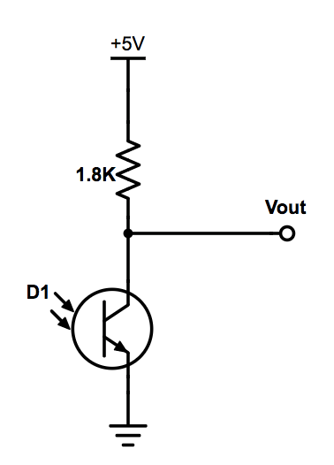

[To Home Page](./index.md)

# Lab 2: Analog circuitry and FFT

## Objective: 

## Acoustic Team:

## Optical Team:
### General Objective: 
In this lab, we utilize skills we learn about IR sensors to integrate sensors and signal processing to interface with the arduino controller on our robot. The two types of IR sensors we explored were acoustic and optical. 
### Optical Sensor Objective: 
In this part of the lab we use a phototransistor to detect an IR beacon transmitter with multiple IR modulation frequencies. We use the FFT music library to create digital filters to allow the IR sensitive transistor to clearly read a signal ranging from 7-17 kHz. 

1) We first begin by developing our photo transistor circuit on a breadboard.

We notice that the amplitude of the signal produced is not high enough to meet the threshold for the transistor to acknowledge the presence of the IR led. Therefore we add an operational amplifier in order to amplify the input source signal.

2) Connecting amplifier to output line of phototransistor 

3) With the amplifier, we notice that the phototransistor is able to determine the threshold between IR light present or not, so we know that we needed a filter to remove the unwanted signals 

4) Designing a high-pass filter 

5) Our Schematic is complete

FINAL CIRCUIT

6) We then checked by probing the IR LED that each frequency was being omitted.

## Merge:

[To Home Page](./index.md)
