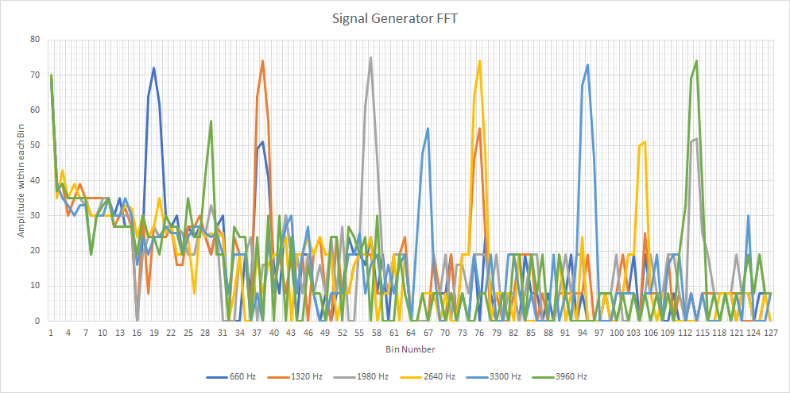
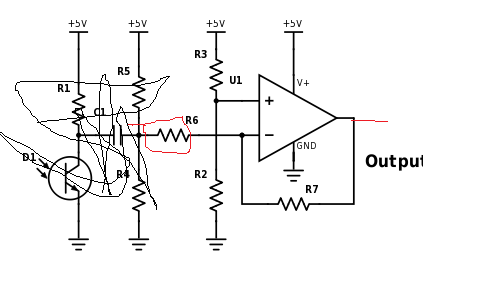

[To Home Page](./index.md)

# Lab 2: Analog circuitry and FFT

## Objective: 

## Acoustic Team:

### FFT Analysis

#### Running Sample Code:
We started off with the sample code given to us by the Open Music Labs Arduino FFT library, the following example code was used in our ideal test, where the input was from a signal generator, and from the microphone test, where the input was played by the phone and received through our microphone.

```
/*
fft_adc_serial.pde
guest openmusiclabs.com 7.7.14
example sketch for testing the fft library.
it takes in data on ADC0 (Analog0) and processes them
with the fft. the data is sent out over the serial
port at 115.2kb.
*/

#define LOG_OUT 1 // use the log output function
#define FFT_N 256 // set to 256 point fft

#include <FFT.h> // include the library

void setup() {
  Serial.begin(115200); // use the serial port
  TIMSK0 = 0; // turn off timer0 for lower jitter
  ADCSRA = 0xe5; // set the adc to free running mode
  ADMUX = 0x40; // use adc0
  DIDR0 = 0x01; // turn off the digital input for adc0
}

void loop() {
  while(1) { // reduces jitter
    cli();  // UDRE interrupt slows this way down on arduino1.0
    for (int i = 0 ; i < 512 ; i += 2) { // save 256 samples
      while(!(ADCSRA & 0x10)); // wait for adc to be ready
      ADCSRA = 0xf5; // restart adc
      byte m = ADCL; // fetch adc data
      byte j = ADCH;
      int k = (j << 8) | m; // form into an int
      k -= 0x0200; // form into a signed int
      k <<= 6; // form into a 16b signed int
      fft_input[i] = k; // put real data into even bins
      fft_input[i+1] = 0; // set odd bins to 0
    }
    fft_window(); // window the data for better frequency response
    fft_reorder(); // reorder the data before doing the fft
    fft_run(); // process the data in the fft
    fft_mag_log(); // take the output of the fft
    sei();
    Serial.println("start");
    for (byte i = 0 ; i < FFT_N/2 ; i++) { 
      Serial.println(fft_log_out[i]); // send out the data
    }
  }
}
```

#### Ideal Signal Output:

We wanted to learn about the FFT sample code given by the Open Music Labs Arduino FFT library example sketches, so we used the signal generator as our microphone by connecting it to our arduino. We played sine waves on various frequencies through the signal generator and plotted the magnitude of each bin from the Arduino onto excel.  The frequencies that we looked at were: 660Hz, 1320Hz, 1980Hz, 2640Hz, 3300Hz, and 3960Hz.

The Excel Plot:



The graph shows the reading in each bin, and since we don’t have a filter, you can see the effects of aliasing in the extra harmonics that are present after the initial large spike. 

#### Microphone Signal Output:

We ran the sample code shown above, but with the signal generator replaced by the Microphone.  We played a tones at various frequencies (660Hz, 1320Hz, 1980Hz, 2640Hz, 3300Hz, and 3960Hz) from our phone and plotted the results the Arduino outputted onto an plot:
  

  
On this plot you can clearly see which bin the played frequency falls into.  Unlike our previous setup, which had the signal from the signal generator go into the Arduino, the microphone has a filter which removes all the extra harmonics that we say before.  This makes our graph clear.


### Distinguishing Tones

#### LED Trigger
To test whether the code was correctly picking up on the 660Hz tone, we implemented Arduino code to light up a green LED when the tone was detected, and off otherwise. Code for lighting up an LED by driving a pin high is the same as in Lab 1. Below is the first version of the integrated code with the FFT analysis:

```
#define LOG_OUT 1 // use the log output function
#define FFT_N 256 // set to 256 point fft
#include <FFT.h> // include the library

int binNum = 20;    // 660Hz bin
int soundThres = 60;    // Threshold for input signal recognition

int D7 = 7;   // LED pin

void setup() {
  Serial.begin(115200); // use the serial port
  pinMode(D7, OUTPUT);  // set up the LED
}


/* Reading the signal. */ 
void loop() {
  while(1) {
    cli();
    for (int i = 0 ; i < 512 ; i += 2) {
      fft_input[i] = analogRead(A0); 
      fft_input[i+1] = 0;
    }
    fft_window();   // window the data for better frequency response
    fft_reorder();   // reorder the data before doing the fft
    fft_run();  // process the data in the fft
    fft_mag_log();  // take the output of the fft
    sei();

/* Sampling and controlling LED */ 
    for (byte i = 0 ; i < FFT_N/2 ; i++) {
      if (fft_log_out[binNum]> soundThres){
        Serial.println("Yay");    // Writes a success message in the serial monitor
        digitalWrite(D7, HIGH);   // Turn on LED
      }
      else{
        digitalWrite(D7, LOW);    // Turn off LED
      }
    }
  }
}
```
Here is a video demonstration:

<iframe width="560" height="315" src="https://www.youtube.com/embed/qPjx3PNxpyI" frameborder="0" allowfullscreen></iframe>

We found that the code worked for sensing the difference between very high, very low, and ~660Hz range tone. However, when testing a smaller interval, the code couldn’t distinguish between 585Hz, 660Hz, and 735Hz. To resolve this, we decided to specifically increase the rate of the Analog-to-Digital Converter (ADC) clock. To do so, we modified the setup to set ADC to free running mode and added code in the main body to accommodate using the ADC clock instead of AnalogRead(). We looked at the sample FFC library code to learn how to adjust the ADC clock. 

##### Result: 
We successfully separated the closer values into different bins. One more problem we encountered was that our LED would light up for the 735Hz tone instead of the 660Hz one. We realized that the starting index of the bin was different from the first index of our Excel chart (from which we read our data), so we simply changed the target bin number. The final code is below:

```
#define LOG_OUT 1 // use the log output function
#define FFT_N 256 // set to 256 point fft
#include <FFT.h> // include the library

int binNum = 18;    // 660Hz bin
int soundThres = 170;   // Threshold for input signal recognition

int D7 = 7;

void setup() {
  Serial.begin(115200); // use the serial port
  TIMSK0 = 0; // turn off timer0 for lower jitter
  ADCSRA = 0xe7; // set the adc to free running mode
  ADMUX = 0x40; // use adc0
  DIDR0 = 0x01; // turn off the digital input for adc0

  pinMode(D7, OUTPUT);
}

void loop() {
  while(1) { // reduces jitter
    cli();  // UDRE interrupt slows this way down on arduino1.0
    for (int i = 0 ; i < 512 ; i += 2) { // save 256 samples
      while(!(ADCSRA & 0x10)); // wait for adc to be ready
      ADCSRA = 0xf7; // restart adc
      byte m = ADCL; // fetch adc data
      byte j = ADCH;
      int k = (j << 8) | m; // form into an int
      k -= 0x0200; // form into a signed int
      k <<= 6; // form into a 16b signed int
      fft_input[i] = k; // put real data into even bins
      fft_input[i+1] = 0; // set odd bins to 0
    }
    fft_window(); // window the data for better frequency response
    fft_reorder(); // reorder the data before doing the fft
    fft_run(); // process the data in the fft
    fft_mag_log(); // take the output of the fft
    sei();


/* Sampling and controlling LED */ 
    for (byte i = 0 ; i < FFT_N/2 ; i++) {
      if (fft_log_out[binNum]> soundThres){
        Serial.println("Yay");    // Writes a success message in the serial monitor
        digitalWrite(D7, HIGH);   // Turn on LED
      }
      else{
        digitalWrite(D7, LOW);    // Turn off LED
      } 
//      Serial.println(fft_log_out[i]); // send out the data
    }
  }
}
```
Here is our data in an Excel chart:


### BONUS!!!!:

Just for fun, we built a low pass filter.  We selected our parameters using the provided filter [wizard website](http://www.analog.com/designtools/en/filterwizard/).


 


## Optical Team:

### General Objective: 

In this lab, we utilize skills we learn about IR sensors to integrate sensors and signal processing to interface with the arduino controller on our robot. The two types of IR sensors we explored were acoustic and optical. 

### Optical Sensor Objective: 

In this part of the lab we use a phototransistor to detect an IR beacon transmitter with multiple IR modulation frequencies. We use the FFT music library to create digital filters to allow the IR sensitive transistor to clearly read a signal ranging from 7-17 kHz. 

1) We first begin by developing our photo transistor circuit on a breadboard.


We notice that the amplitude of the signal produced is not high enough to meet the threshold for the transistor to acknowledge the presence of the IR led. Therefore we add an operational amplifier in order to amplify the input source signal.

2) Connecting amplifier to output line of phototransistor 

3) With the amplifier, we notice that the phototransistor is able to determine the threshold between IR light present or not, so we know that we needed a filter to remove the unwanted signals 

4) Designing a high-pass filter 

5) Our Schematic is complete

FINAL CIRCUIT:


6) We then checked by probing the IR LED that each frequency was being omitted.


7) We then apply a digital filter through the FFT library and check to see if our treasurer is detected by the phototransistor at various frequencies. As seen in the graph below,


When there was no IR light detected, we notice that there is no obvious spike in any of the bins, indicating no frequencies were detected


7kHz, we see that there is a spike, as calculated at bin 49.


12kHz, we see that there is a spike around bin 80.


17kHz, we observe a spike around bin 117. 


Once confirming the design on the breadboard was successful, we prototyped a breakout board to fit onto our robot. Reevaluating the new circuit with multiple tests.  


Good News: We were successfully able to identify IR treasurer with all frequencies. 


## Merge:


[To Home Page](./index.md)
