[To Home Page](./index.md)

# Lab 3: FPGA Video Controller and Sound Generation

## Over all Objective: 
Lab 3 introduces the FPGA to our current setup.  The six of us were split into two teams.  One was incharge of setting up the VGA 

## Graphics Team:
Yijia Chen, Thinesiya Krishnthasan, Stephanie Lin 

### Objective:
In this section of the lab we learned how to create a VGA output from a FPGA board.

### Description of how the DAC on the provided VGA connectors works and how the resistor values were chosen.

We used an 8-bit DAC (Digital to Analog Converter) to encode colors to the display. It uses 3 bits to represent values for green and red, and 2 bits for blue. The DAC uses 8 pins to connect to the FPGA board, and the sections for each color combine to produce a voltage between 0 and 1V. We use the resistors to step down the voltage from 3.3 volts to designated voltages calculated using a voltage divider. The resistor values calculated allow us to step down the voltage to our desired values. Since the red and green colors are comprised of 3 bits each and blue is comprised of 2, there should be 8 possible colors and therefore 8 different voltages (with a 1/7V difference).

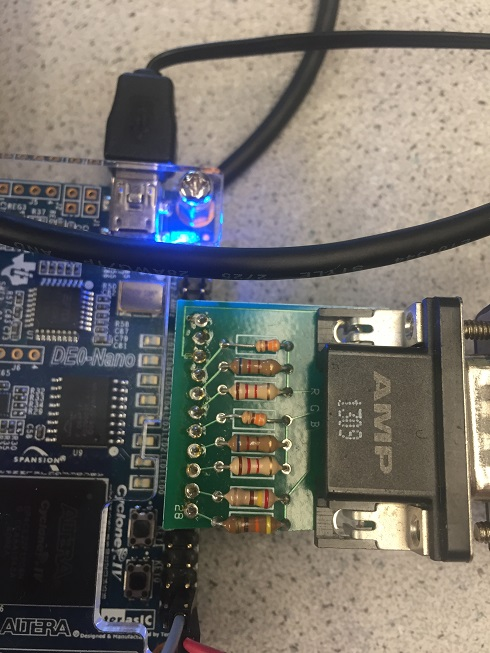

The DAC converter connected to a VGA cable is shown above. Each color is labeled by R, G, and B. They have resistors in parallel along with the VGA cable having 50Ω resistance in series. The calculations and diagram shown below are set up so that each color pin sums to a total of 1V with each pin representing a bit. The most significant bit has twice the voltage of the second most significant bit, four times as much voltage as the third, and so on and so forth. The voltages turned out to be 1/7V, 2/7V, and 4/7V in order of increasing bit significance. (For blue, since there are only two bits, the voltages were ⅓V and ⅔V instead). 

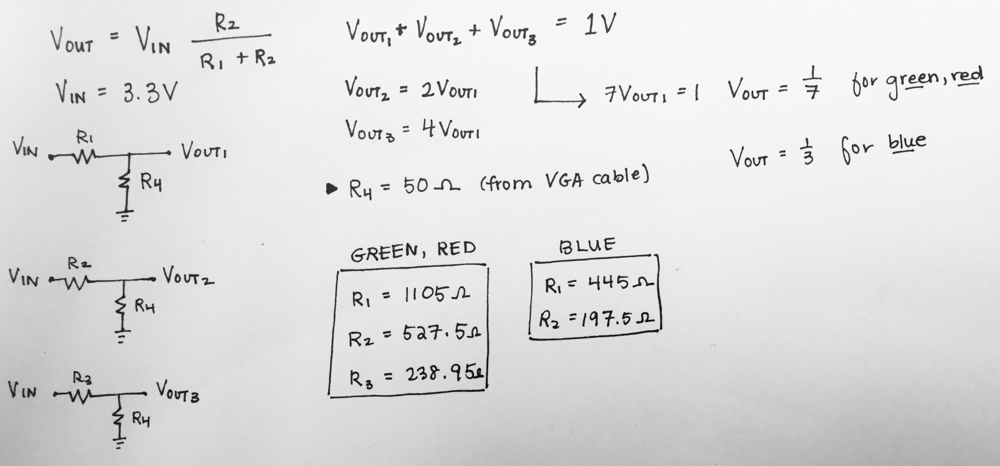

### Green Screen

To begin with, we set the whole screen color in green. The idea is let every pixel be green.

```verilog
always @ (posedge CLOCK_25) begin
     PIXEL_COLOR <= 8’b000_000_11
```

### Reading external inputs to FPGA

We can  read external inputs to FPGA by assign certain pins and connecting them with wires.  The wires are connected with external inputs.
```verilog
       wire highlighted_x;
       wire highlighted_y;	 
      //Switch input through GPIO pins
       assign highlighted_x = GPIO_0_D[33];
       assign highlighted_y = GPIO_0_D[31];
```
### Correctly updating a 4-bit array dependent on the inputs

We divide the screen into 4 parts with the background in black and display blue in the chosen part. We use two switches to control the location,one for x, one for y.  [0,0] represents up-left, [0,1] represents up-right, [1,0] represents down-left, [1,1] represents down-left. the chosen part will display blue otherwise it’s in black.
```verilog
always @ (posedge CLOCK_25) begin
        pixel_grid[0][0] <= (highlighted_x==0 && highlighted_y==0)? 8'b000_000_11 : 8'b000_000_00; 
        pixel_grid[0][1] <= (highlighted_x==0 && highlighted_y==1)? 8'b000_000_11 : 8'b000_000_00; 
        pixel_grid[1][0] <= (highlighted_x==1 && highlighted_y==0)? 8'b000_000_11 : 8'b000_000_00; 
        pixel_grid[1][1] <= (highlighted_x==1 && highlighted_y==1)? 8'b000_000_11 : 8'b000_000_00; 

```
### Drawing one box on the screen

To draw a box, we set the corresponding pixels in red, and displayed it.

```verilog
	always @ (posedge CLOCK_25) begin
		pixel_grid[0][0] <=  8'b111_000_00;  // red
       		pixel_grid[0][1] <=  8'b000_000_00;  // black
        	pixel_grid[1][0] <=  8'b000_000_00;  // black
        	pixel_grid[1][1] <=  8'b000_000_00;  // black
		  
	  	if(PIXEL_COORD_X < 10'd320 && PIXEL_COORD_Y < 10'd240) begin
			PIXEL_COLOR <= pixel_grid[0][0];
		end
			
		if(PIXEL_COORD_X >= 10'd320 && PIXEL_COORD_Y < 10'd240) begin
			PIXEL_COLOR <= pixel_grid[0][1];
		 end
			
		 if(PIXEL_COORD_X < 10'd320 && PIXEL_COORD_Y >= 10'd240) begin
			PIXEL_COLOR <= pixel_grid[1][0];
		 end
		 	
		 if(PIXEL_COORD_X >= 10'd320 && PIXEL_COORD_Y >= 10'd240) begin
			PIXEL_COLOR <= pixel_grid[1][1];
		 end
			
```

### Toggle using LED:
Before writing Verilog to take in inputs that would switch among the four squares we first used buttons on the FPGA board to control one and then multiple LED.  We used as a starting step so that we will have the input logic down before adding in the VGA component.

We first used the FPGA to toggle one LED.
```verilog	
 // Simple state machine to toggle LED0 every one second
	 always @ (posedge CLOCK_25) begin
		  if (reset) begin
				grid_array[0][0] <= 1'b0;
				grid_array[1][0] <= 1'b0;
				grid_array[0][1] <= 1'b0;
				grid_array[1][1] <= 1'b0;
				led_counter <= 25'b0;
		  end
		  
		  if (led_counter == HALF_SEC) begin
				// at 1/2 second, turn on LED 1/3
				grid_array[0][0] <= ~grid_array[0][0];
				grid_array[1][0] <= ~grid_array[1][0];
				//led_state   <= ~led_state;
				led_counter <= led_counter + 25'b1;
		  end
		  
		  else if (led_counter == ONE_SEC) begin
				// at 1 second, turn off LED 0/3, turn on LED 2/4
				grid_array[0][0] <= ~grid_array[0][0];
				grid_array[1][0] <= ~grid_array[1][0];
				grid_array[0][1] <= ~grid_array[0][1];
				grid_array[1][1] <= ~grid_array[1][1];
				led_counter <= 25'b0; // reset clock
		  end 
		  
		  else begin	
				// stay the same, clock increments
				grid_array[0][0] <= grid_array[0][0];
				grid_array[0][1] <= grid_array[0][1];
				grid_array[1][0] <= grid_array[1][0];
				grid_array[1][1] <= grid_array[1][1];
				led_counter <= led_counter + 25'b1;
		  end 
	 end
```

We next used the button on the FPGA board to control multiple LEDs:

<iframe width="560" height="315" src="https://www.youtube.com/embed/iLnJGlyvGGo" frameborder="0" allowfullscreen></iframe>

```verilog
	 // Simple state machine to toggle multiple LEDs controlled by button
	 always @ (posedge CLOCK_25) begin
		  if (reset) begin
				key_counter<= 4'b0;
				
		  end
		  
		else if(~KEY[1]) begin
			
			if (key_counter == 4'b100) begin
				key_counter <= 4'b0;
			end
			else begin
				key_counter <= key_counter + 4'b1;
			end	
					
		end
		  
	 end
```
	

### Mapping external inputs to four different outputs on the screen
We first mapped out our switch inputs to positions on the screen:


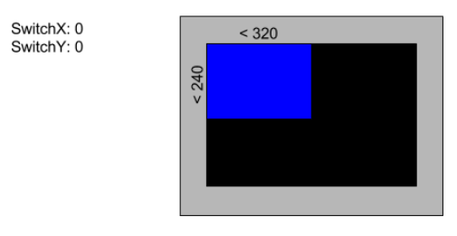

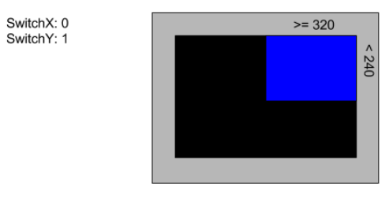

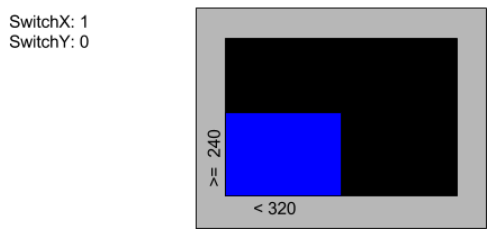

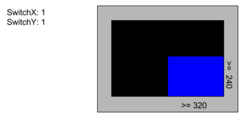


We also had to build a circuit containing a circuit and voltage divider.  The voltage divider is used to decrease the 5V output from the Arduino to 3.3V which is the voltage limit for the FPGA board.


The following video shows us controlling the VGA from inputs given by switches:

<iframe width="560" height="315" src="https://www.youtube.com/embed/eVZMVpm_ZxY" frameborder="0" allowfullscreen></iframe>

Here is the full code that performs the functions shown in the video above: 
```verilog
//=======================================================
// ECE3400 Fall 2017
// Lab 3: Switch Among f Squares
//=======================================================

`define ONE_SEC 25000000
`define HALF_SEC 12500000

module DE0_NANO(

	//////////// CLOCK //////////
	CLOCK_50,

	//////////// LED //////////
	LED,

	//////////// KEY //////////
	KEY,

	//////////// SW //////////
	SW,

	//////////// GPIO_0, GPIO_0 connect to GPIO Default //////////
	GPIO_0_D,
	GPIO_0_IN,

	//////////// GPIO_0, GPIO_1 connect to GPIO Default //////////
	GPIO_1_D,
	GPIO_1_IN,
);

	 //=======================================================
	 //  PARAMETER declarations
	 //=======================================================

	 localparam ONE_SEC = 25000000; // one second in 25MHz clock cycles
	 localparam HALF_SEC = 12500000; // half a second in 25MHz clock cycles
	 
	 //=======================================================
	 //  PORT declarations
	 //=======================================================

	 //////////// CLOCK //////////
	 input 		          		CLOCK_50;

	 //////////// LED //////////
	 output		     [7:0]		LED;

	 /////////// KEY //////////
	 input 		     [1:0]		KEY;

	 //////////// SW //////////
	 input 		     [3:0]		SW;

	 //////////// GPIO_0, GPIO_0 connect to GPIO Default //////////
	 inout 		    [33:0]		GPIO_0_D;
	 input 		     [1:0]		GPIO_0_IN;

	 //////////// GPIO_0, GPIO_1 connect to GPIO Default //////////
	 inout 		    [33:0]		GPIO_1_D;
	 input 		     [1:0]		GPIO_1_IN;
	 


    //=======================================================
    //  REG/WIRE declarations
    //=======================================================
    reg         CLOCK_25;
    wire        reset; // active high reset signal 
	 
	 

    wire [9:0]  PIXEL_COORD_X; // current x-coord from VGA driver
    wire [9:0]  PIXEL_COORD_Y; // current y-coord from VGA driver
    reg [7:0]  PIXEL_COLOR;   // input 8-bit pixel color for current coords
	 
	 reg [7:0]  pixel_grid [1:0][1:0]; 
	 
	 reg [24:0] led_counter; // timer to keep track of when to toggle LED
	 reg 			led_state;   // 1 is on, 0 is off
	 //reg grid_array [1:0][1:0]; //[rows][columns]
	 
	//reg [3:0]	key_counter;  // counts how many times key1 has been pressed
	 
    // Module outputs coordinates of next pixel to be written onto screen
    VGA_DRIVER driver(
		  .RESET(reset),
        .CLOCK(CLOCK_25),
        .PIXEL_COLOR_IN(PIXEL_COLOR),
        .PIXEL_X(PIXEL_COORD_X),
        .PIXEL_Y(PIXEL_COORD_Y),
        .PIXEL_COLOR_OUT({GPIO_0_D[9],GPIO_0_D[11],GPIO_0_D[13],GPIO_0_D[15],GPIO_0_D[17],GPIO_0_D[19],GPIO_0_D[21],GPIO_0_D[23]}),
        .H_SYNC_NEG(GPIO_0_D[7]),
        .V_SYNC_NEG(GPIO_0_D[5])
    );
	 
	 assign reset = ~KEY[0]; // reset when KEY0 is pressed
	 
	 
    //=======================================================
    //  Structural coding
    //=======================================================
 
 
	 // Generate 25MHz clock for VGA, FPGA has 50 MHz clock
    always @ (posedge CLOCK_50) begin
        CLOCK_25 <= ~CLOCK_25; 
    end // always @ (posedge CLOCK_50)
	
	 
	//2-by-2 array of bits
       reg grid_array [1:0][1:0]; //[rows][columns]
       wire [1:0] grid_coord_x; //Index x into the array
       wire [1:0] grid_coord_y; //Index y into the array
      // current highlighted square
       wire highlighted_x;
       wire highlighted_y;	 
      //Switch input through GPIO pins
       	assign highlighted_x = GPIO_0_D[33];
       	assign highlighted_y = GPIO_0_D[31];
 	assign GPIO_CLK = GPIO_0_D[29];
		 
		always @ (posedge CLOCK_25) begin
		  	pixel_grid[0][0] <= (highlighted_x==0 && highlighted_y==0)? 8'b000_000_11 : 8'b000_000_00; 
        		pixel_grid[0][1] <= (highlighted_x==0 && highlighted_y==1)? 8'b000_000_11 : 8'b000_000_00; 
        		pixel_grid[1][0] <= (highlighted_x==1 && highlighted_y==0)? 8'b000_000_11 : 8'b000_000_00; 
        		pixel_grid[1][1] <= (highlighted_x==1 && highlighted_y==1)? 8'b000_000_11 : 8'b000_000_00; 
		  
		  if(PIXEL_COORD_X < 10'd320 && PIXEL_COORD_Y < 10'd240) begin
			PIXEL_COLOR <= pixel_grid[0][0];	
		  end
	
		  if(PIXEL_COORD_X >= 10'd320 && PIXEL_COORD_Y < 10'd240) begin
			PIXEL_COLOR <= pixel_grid[0][1];
		  end
			
		  if(PIXEL_COORD_X < 10'd320 && PIXEL_COORD_Y >= 10'd240) begin
			PIXEL_COLOR <= pixel_grid[1][0];
		  end
		 	
		  if(PIXEL_COORD_X >= 10'd320 && PIXEL_COORD_Y >= 10'd240) begin
			PIXEL_COLOR <= pixel_grid[1][1];
		  end


endmodule

```


 

### Team Sound

Peter Slater, Mira Bhut, Yirong Alan

##### Part 1: Building the DAC

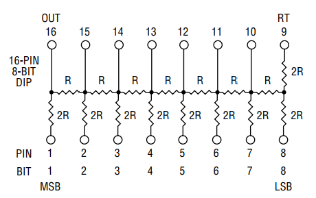

Figure 1: Resistor network of the 8-Bit R2R DAC, sourced from this [datasheet](https://www.bourns.com/pdfs/r2rap.pdf).


We started this lab by building a R2R Digital to Analog converter (DAC) to convert the digital FPGA outputs to an analog voltage audio signal. This circuit gets it's name because it is built from a resistor network composed of resistances R and 2R and is pictured in Figure 1. The 8-Bit R2R DAC is packaged in a 16-dip package that was user friendly and easy to solder.

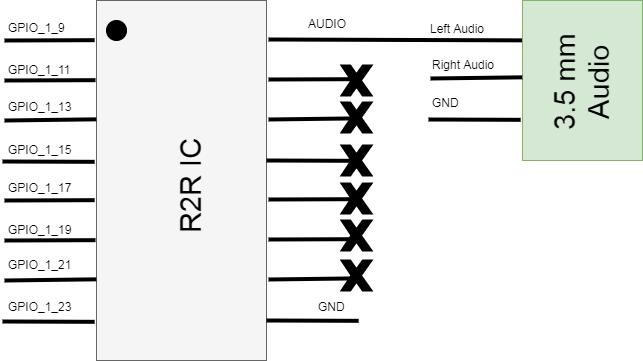

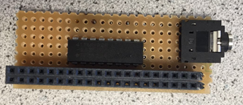

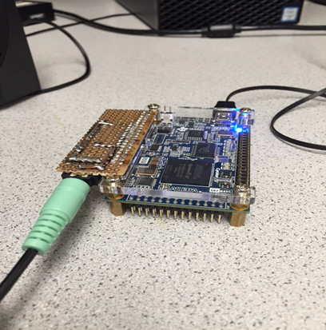

Figure 2: The schematic of the finished 8-bit DAC Circuit (top), the soldered board (middle) and the board and FPGA assembly with speaker connected (bottom).

We built the circuit described in Figure 2 by soldering the components onto a piece of perf-board with a mating connector to the FPGA. We choose to use GPIO 1 since the display team was already using GPIO 0 for the VGA output and the specific pins were chosen because it was the only continuous GPIO section with a ground pin nearby. The board could then be plugged into the FPGA and the speaker can connect to the 3.5 mm audio jack.

##### Part 2: Creating a Sine Wave

We created our sound through a method known as direct digital synthesis (DDS). In this method, one period of a sine wave is sampled at discrete intervals, in our case 256, and each sample is output for that interval. To implement this we created a Verilog module SINE_LUT.v using Matlab code that would generate the samples, pack them into 8-Bit values, then write the Verilog module.

Matlab Code:

```matlab
clear all;

% frequency to sample
fo= 1e3;
% number of samples to collect
Nsamp = 256;
fs = Nsamp*fo;

% generate the sampled cos 
t = linspace(0,1/fo,Nsamp);
s = sampled_sin(t,fo,fs);
P = pack_samples(s,8);

subplot(2,1,1);
plot(s)
subplot(2,1,2);
stairs(P);

fid = fopen('./SINE_LUT.v', 'w');
verilog_sinLUT(fid,P);

function P = pack_samples(s, n)
    min_s = min(s);
    max_s = max(s);

    % Normalize Sample Data to [0:2^n - 1]
    s = (s - min_s) / (max_s - min_s) * (2.^n - 1);
    P = fix(s);
end

function verilog_sinLUT(fid, data)
    n = length(data);
    fprintf(fid, 'module SINE_ROM(input [%i:0] addr, input clk, output reg [7:0] q);\r\n', ceil(log2(n))-1);
    fprintf(fid, '\treg [7:0] sine[%i:0];\r\n', n-1);
    
    fprintf(fid, '\tinitial\r\n\tbegin\r\n');
    for i = 0:n-1
        fprintf(fid, '\t\tsine[%i] <= 8''b%s;\r\n', i,num2str(dec2bin(data(i+1),8)));
    end
    fprintf(fid, '\tend\r\n');
    
    fprintf(fid, '\talways @ (posedge clk)\r\n\tbegin\r\n');
    fprintf(fid, '\t\tq <= sine[addr];\r\n\tend\r\n');
    fprintf(fid, 'endmodule\r\n');
end
```

Verilog Code:

```verilog
module SINE_LUT(input [7:0] addr, input clk, output reg [7:0] q);
	reg [7:0] sine[255:0];
	initial
	begin
		sine[0] <= 8'b01111111 
// rest of the bits
		sine[255] <= 8'b01111111;
	end
	always @ (posedge clk)
	begin
		q <= sine[addr];
	end
endmodule

```

Sound is then created by instantiating this module in our main code and on every edge of the 25 MHz clock a variable *data_counter* is incremented and when this counter surpasses a threshold value (96) a new sample is read from the sine wave. The value of 96 was chosen because it would get us a frequency close to 1 kHz (25 MHz / 256 Samples / 96 = 1017 kHz) The code to do this is included below.

```verilog
always @ (posedge CLOCK_25) begin
  if (reset) begin
    data_state   <= 8'b0;
    data_counter <= 25'b0;           
  end

  if (data_counter == 96) begin
    data_state <= data_state + 8'b1;
    data_counter <= 25'b0;
  end

  else begin 	
    data_state   <= data_state;
    data_counter <= data_counter + 25'b1;
  end            	 
end
```

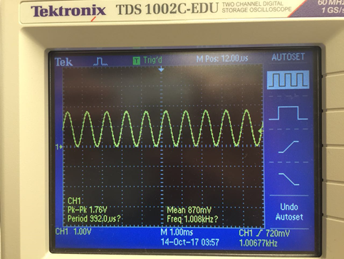

Figure 3: The output 1 kHz sine wave

The output of the DAC was measured with an oscilloscope and is displayed in Figure 3. The measured frequency is 1.00677 kHz which is very close to the designed 1 kHz frequency. We can also notice a small amount of stair stepping in the steep regions that is from the limited resolution of the 8 bit DAC. One problem that we noticed at this time is that the maximum amplitude of the signal was only about half of what was expected (3.3 V). We found that this error was caused by accidentally shorting out the left and right audio channels. This error was fixed in the final circuit by removing the short.

##### Part 3: Creating a Tune

The problem statement described a tune as a sequence of three tones. To create this we modified our sine wave from Part 2 by changing the threshold value (T). This had the effect of frequency modulating our sine wave output and can be used to create a tone. The math for this is: freq = 25 MHz / 256 Samples / T. In our case we chose three frequencies to play 1 kHz (96), 2 kHz (48), and 680 Hz (144). Each of these thresholds were sequenced by introducing a *count* variable into our that allow us to specify a period to play each tone. The code and a short video demoing the three tone being played are included below .

```verilog
localparam Freq1 = 96;
localparam Freq2 = 48;
localparam Freq3 = 144;

reg [24:0] count;
reg [24:0] data_counter;
reg [7:0] data_state;
wire [7:0] amplitude;

SINE_LUT sin(
  .addr (data_state),
  .clk (CLOCK_25),
  .q (amplitude)
);

always @ (posedge CLOCK_25) begin
  if (reset) begin
    data_state   <= 8'b00000000;
    data_counter <= 25'b0;
    count <= 25'b0;

  end

  if (0<=count && count<300000 && data_counter == Freq1) begin
    data_state   <= data_state + 8'b00000001;
    count <= count + 25'b1;
    data_counter <= 25'b0;
  end

  else if (300000<=count && count<900000 && data_counter == Freq2) begin
    data_state   <= data_state + 8'b00000001;
    count <= count + 25'b1;
    data_counter <= 25'b0;
  end

  else if (900000<=count && count<1100000 && led_counter == Freq3) begin
    data_state   <= data_state + 8'b00000001;
    count <= count + 25'b1;
    data_counter <= 25'b0;
  end

  else if (count == 1100000)
    count <= 25'b0;

  else begin 	
    data_state   <= data_state;
    data_counter <= data_counter + 25'b1;
  end // always @ (posedge CLOCK_25)

end
```

<iframe width="560" height="315" src="https://www.youtube.com/embed/5nfu_jhT2kA" frameborder="0" allowfullscreen></iframe>

##### Part 4: Creating a Square Wave

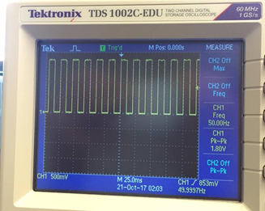

Figure 4: The square wave output on the oscilloscope

It was at this time that we actually read the requirements for this lab and realize that we skipped a few steps. We were supposed to create a square wave before we created our tune so we hacked our code to create one. To do this we examined the generated sine table and found two entries that corresponded to all ones (64) and all zeros (188) and we then generated code that would alternate between these two entries. We generated a 50 Hz square wave by toggling every 250,000 clock cycles (25 MHz / 250000 /2) where the division of two occurs because one period of the square wave has two toggles. The output was verified on an oscilloscope and the the frequency was dead on at 49.99997 Hz. The code for this part is included below.

```verilog
// Basically we're using two values of the sine look up table (sin[64] & sin[188])
// to simulate the high and low level of the square wave. The detail about sine look-up
// table is in next section.

reg [24:0] data_counter; // timer
reg [7:0] data_state;   // the index of the sin_LUT
wire [7:0] amplitude;

// Sine LUT module
SINE_LUT sin(
  .addr(data_state),
  .clk(CLOCK_25),
  .q(amplitude)
);

always @ (posedge CLOCK_25) begin
  if (reset) begin
    data_state   <= 8'b01000000;
    data_counter <= 25'b0;                  	
  end

  if (data_counter == 250000) begin
    if(data_state == 8'b01000000)
      data_state <= 8'b10111100;
    else
      data_state <= 8'b01000000;

    data_counter <= 25'b0;
  end

  else begin 	
    data_state   <= data_state;
    data_counter <= data_counter + 25'b1;
  end            	 
end
```


[To Home Page](./index.md)
