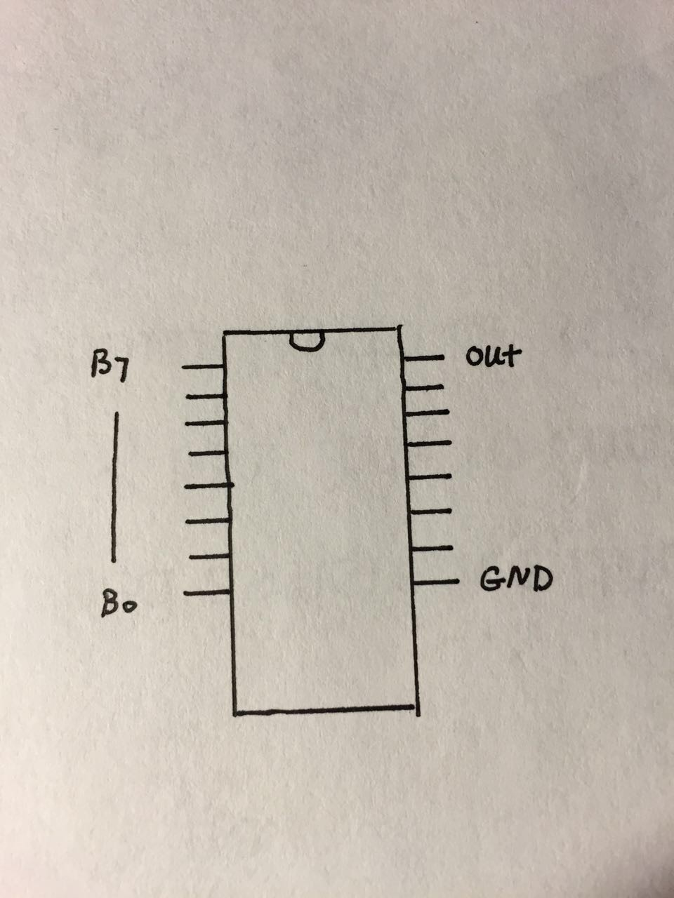
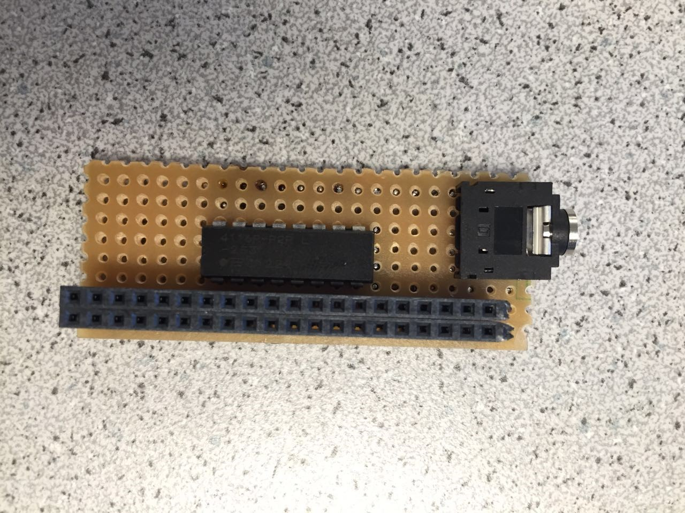
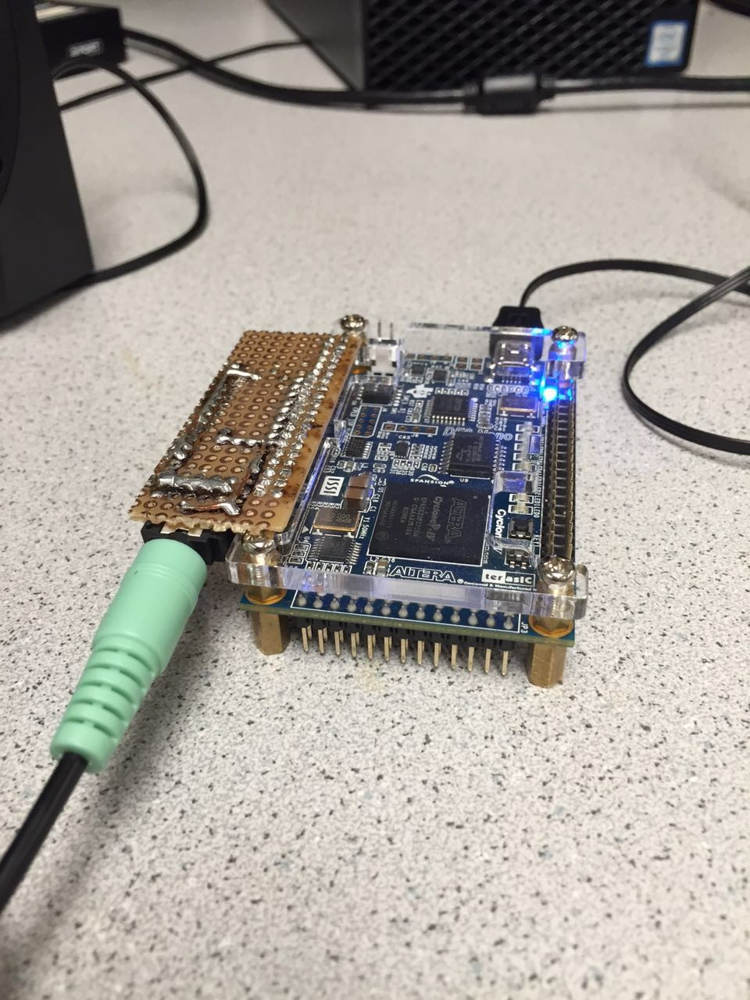
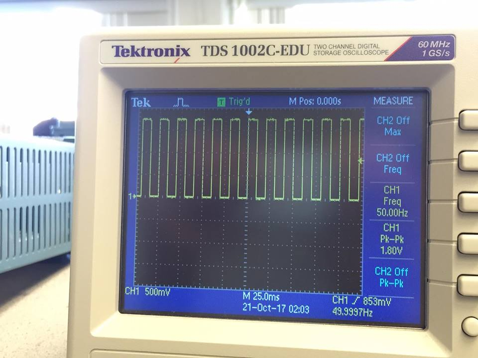
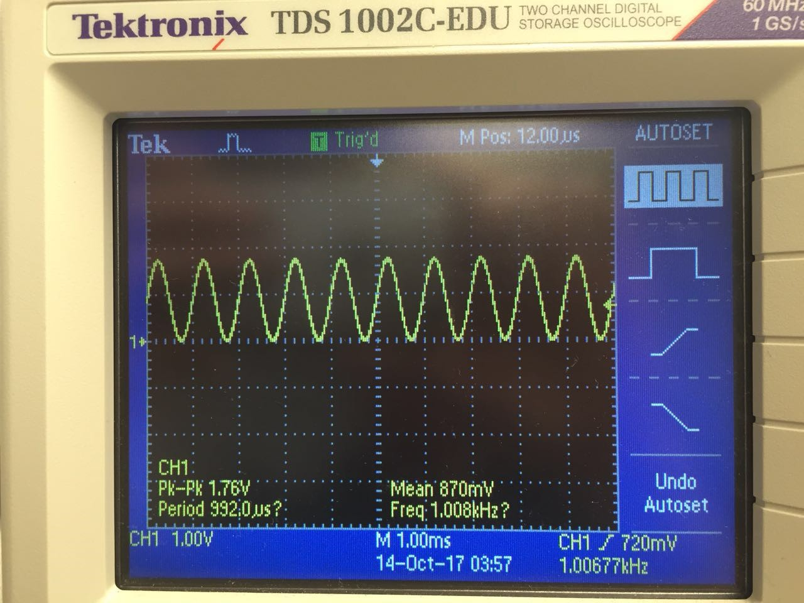

[To Home Page](./index.md)

# Lab 3: FPGA Video Controller and Sound Generation

## Over all Objective: 
Lab 3 introduces the FPGA to our current setup.  The six of us were split into two teams.  One was incharge of setting up the VGA 

## Graphics Team:
* Stephanie
* Yijia
* Thinesiya 

### Objective:
In this section of the lab we learned how to create a VGA output from a FPGA board.

### Description of how the DAC on the provided VGA connectors works and how the resistor values were chosen.

We used an 8-bit DAC (Digital to Analog Converter) to encode colors to the display. It uses 3 bits to represent values for green and red, and 2 bits for blue. The DAC uses 8 pins to connect to the FPGA board, and the sections for each color combine to produce a voltage between 0 and 1V. We use the resistors to step down the voltage from 3.3 volts to designated voltages calculated using a voltage divider. The resistor values calculated allow us to step down the voltage to our desired values. Since the red and green colors are comprised of 3 bits each and blue is comprised of 2, there should be 8 possible colors and therefore 8 different voltages (with a 1/7V difference).


The DAC converter connected to a VGA cable is shown above. Each color is labeled by R, G, and B. They have resistors in parallel along with the VGA cable having 50Ω resistance in series. The calculations and diagram shown below are set up so that each color pin sums to a total of 1V with each pin representing a bit. The most significant bit has twice the voltage of the second most significant bit, four times as much voltage as the third, and so on and so forth. The voltages turned out to be 1/7V, 2/7V, and 4/7V in order of increasing bit significance. (For blue, since there are only two bits, the voltages were ⅓V and ⅔V instead). 


### Green Screen

To begin with, we set the whole screen color in green. The idea is let every pixel be green.

```
always @ (posedge CLOCK_25) begin
     PIXEL_COLOR <= 8’b000_000_11
```

### Reading external inputs to FPGA

We can  read external inputs to FPGA by assign certain pins and connecting them with wires.  The wires are connected with external inputs.
```
       wire highlighted_x;
       wire highlighted_y;	 
      //Switch input through GPIO pins
       assign highlighted_x = GPIO_0_D[33];
       assign highlighted_y = GPIO_0_D[31];
```
### Correctly updating a 4-bit array dependent on the inputs

We divide the screen into 4 parts with the background in black and display blue in the chosen part. We use two switches to control the location,one for x, one for y.  [0,0] represents up-left, [0,1] represents up-right, [1,0] represents down-left, [1,1] represents down-left. the chosen part will display blue otherwise it’s in black.
```
always @ (posedge CLOCK_25) begin
        pixel_grid[0][0] <= (highlighted_x==0 && highlighted_y==0)? 8'b000_000_11 : 8'b000_000_00; 
        pixel_grid[0][1] <= (highlighted_x==0 && highlighted_y==1)? 8'b000_000_11 : 8'b000_000_00; 
        pixel_grid[1][0] <= (highlighted_x==1 && highlighted_y==0)? 8'b000_000_11 : 8'b000_000_00; 
        pixel_grid[1][1] <= (highlighted_x==1 && highlighted_y==1)? 8'b000_000_11 : 8'b000_000_00; 

```
### Drawing one box on the screen

To draw a box, we set the corresponding pixels in red, and displayed it.

```
	always @ (posedge CLOCK_25) begin
		pixel_grid[0][0] <=  8'b111_000_00;  // red
       		pixel_grid[0][1] <=  8'b000_000_00;  // black
        	pixel_grid[1][0] <=  8'b000_000_00;  // black
        	pixel_grid[1][1] <=  8'b000_000_00;  // black
		  
	  	if(PIXEL_COORD_X < 10'd320 && PIXEL_COORD_Y < 10'd240) begin
			PIXEL_COLOR <= pixel_grid[0][0];
		end
			
		if(PIXEL_COORD_X >= 10'd320 && PIXEL_COORD_Y < 10'd240) begin
			PIXEL_COLOR <= pixel_grid[0][1];
		 end
			
		 if(PIXEL_COORD_X < 10'd320 && PIXEL_COORD_Y >= 10'd240) begin
			PIXEL_COLOR <= pixel_grid[1][0];
		 end
		 	
		 if(PIXEL_COORD_X >= 10'd320 && PIXEL_COORD_Y >= 10'd240) begin
			PIXEL_COLOR <= pixel_grid[1][1];
		 end
			
```

### Toggle using LED:
Before writing Verilog to take in inputs that would switch among the four squares we first used buttons on the FPGA board to control one and then multiple LED.  We used as a starting step so that we will have the input logic down before adding in the VGA component.

We first used the FPGA to toggle one LED.
```	
 // Simple state machine to toggle LED0 every one second
	 always @ (posedge CLOCK_25) begin
		  if (reset) begin
				grid_array[0][0] <= 1'b0;
				grid_array[1][0] <= 1'b0;
				grid_array[0][1] <= 1'b0;
				grid_array[1][1] <= 1'b0;
				led_counter <= 25'b0;
		  end
		  
		  if (led_counter == HALF_SEC) begin
				// at 1/2 second, turn on LED 1/3
				grid_array[0][0] <= ~grid_array[0][0];
				grid_array[1][0] <= ~grid_array[1][0];
				//led_state   <= ~led_state;
				led_counter <= led_counter + 25'b1;
		  end
		  
		  else if (led_counter == ONE_SEC) begin
				// at 1 second, turn off LED 0/3, turn on LED 2/4
				grid_array[0][0] <= ~grid_array[0][0];
				grid_array[1][0] <= ~grid_array[1][0];
				grid_array[0][1] <= ~grid_array[0][1];
				grid_array[1][1] <= ~grid_array[1][1];
				led_counter <= 25'b0; // reset clock
		  end 
		  
		  else begin	
				// stay the same, clock increments
				grid_array[0][0] <= grid_array[0][0];
				grid_array[0][1] <= grid_array[0][1];
				grid_array[1][0] <= grid_array[1][0];
				grid_array[1][1] <= grid_array[1][1];
				led_counter <= led_counter + 25'b1;
		  end 
	 end
```

We next used the button on the FPGA board to control multiple LEDs:

<iframe width="560" height="315" src="https://www.youtube.com/embed/iLnJGlyvGGo" frameborder="0" allowfullscreen></iframe>

```
	 // Simple state machine to toggle multiple LEDs controlled by button
	 always @ (posedge CLOCK_25) begin
		  if (reset) begin
				key_counter<= 4'b0;
				
		  end
		  
		else if(~KEY[1]) begin
			
			if (key_counter == 4'b100) begin
				key_counter <= 4'b0;
			end
			else begin
				key_counter <= key_counter + 4'b1;
			end	
					
		end
		  
	 end
```
	

### Mapping external inputs to four different outputs on the screen
We first mapped out our switch inputs to positions on the screen:


We also had to build a circuit containing a circuit and voltage divider.  The voltage divider is used to decrease the 5V output from the Arduino to 3.3V which is the voltage limit for the FPGA board.


The following video shows us controlling the VGA from inputs given by switches:

<iframe width="560" height="315" src="https://www.youtube.com/embed/eVZMVpm_ZxY" frameborder="0" allowfullscreen></iframe>

Here is the full code that performs the functions shown in the video above: 
```
//=======================================================
// ECE3400 Fall 2017
// Lab 3: Switch Among f Squares
//=======================================================

`define ONE_SEC 25000000
`define HALF_SEC 12500000

module DE0_NANO(

	//////////// CLOCK //////////
	CLOCK_50,

	//////////// LED //////////
	LED,

	//////////// KEY //////////
	KEY,

	//////////// SW //////////
	SW,

	//////////// GPIO_0, GPIO_0 connect to GPIO Default //////////
	GPIO_0_D,
	GPIO_0_IN,

	//////////// GPIO_0, GPIO_1 connect to GPIO Default //////////
	GPIO_1_D,
	GPIO_1_IN,
);

	 //=======================================================
	 //  PARAMETER declarations
	 //=======================================================

	 localparam ONE_SEC = 25000000; // one second in 25MHz clock cycles
	 localparam HALF_SEC = 12500000; // half a second in 25MHz clock cycles
	 
	 //=======================================================
	 //  PORT declarations
	 //=======================================================

	 //////////// CLOCK //////////
	 input 		          		CLOCK_50;

	 //////////// LED //////////
	 output		     [7:0]		LED;

	 /////////// KEY //////////
	 input 		     [1:0]		KEY;

	 //////////// SW //////////
	 input 		     [3:0]		SW;

	 //////////// GPIO_0, GPIO_0 connect to GPIO Default //////////
	 inout 		    [33:0]		GPIO_0_D;
	 input 		     [1:0]		GPIO_0_IN;

	 //////////// GPIO_0, GPIO_1 connect to GPIO Default //////////
	 inout 		    [33:0]		GPIO_1_D;
	 input 		     [1:0]		GPIO_1_IN;
	 


    //=======================================================
    //  REG/WIRE declarations
    //=======================================================
    reg         CLOCK_25;
    wire        reset; // active high reset signal 
	 
	 

    wire [9:0]  PIXEL_COORD_X; // current x-coord from VGA driver
    wire [9:0]  PIXEL_COORD_Y; // current y-coord from VGA driver
    reg [7:0]  PIXEL_COLOR;   // input 8-bit pixel color for current coords
	 
	 reg [7:0]  pixel_grid [1:0][1:0]; 
	 
	 reg [24:0] led_counter; // timer to keep track of when to toggle LED
	 reg 			led_state;   // 1 is on, 0 is off
	 //reg grid_array [1:0][1:0]; //[rows][columns]
	 
	//reg [3:0]	key_counter;  // counts how many times key1 has been pressed
	 
    // Module outputs coordinates of next pixel to be written onto screen
    VGA_DRIVER driver(
		  .RESET(reset),
        .CLOCK(CLOCK_25),
        .PIXEL_COLOR_IN(PIXEL_COLOR),
        .PIXEL_X(PIXEL_COORD_X),
        .PIXEL_Y(PIXEL_COORD_Y),
        .PIXEL_COLOR_OUT({GPIO_0_D[9],GPIO_0_D[11],GPIO_0_D[13],GPIO_0_D[15],GPIO_0_D[17],GPIO_0_D[19],GPIO_0_D[21],GPIO_0_D[23]}),
        .H_SYNC_NEG(GPIO_0_D[7]),
        .V_SYNC_NEG(GPIO_0_D[5])
    );
	 
	 assign reset = ~KEY[0]; // reset when KEY0 is pressed
	 
	 
    //=======================================================
    //  Structural coding
    //=======================================================
 
 
	 // Generate 25MHz clock for VGA, FPGA has 50 MHz clock
    always @ (posedge CLOCK_50) begin
        CLOCK_25 <= ~CLOCK_25; 
    end // always @ (posedge CLOCK_50)
	
	 
	//2-by-2 array of bits
       reg grid_array [1:0][1:0]; //[rows][columns]
       wire [1:0] grid_coord_x; //Index x into the array
       wire [1:0] grid_coord_y; //Index y into the array
      // current highlighted square
       wire highlighted_x;
       wire highlighted_y;	 
      //Switch input through GPIO pins
       	assign highlighted_x = GPIO_0_D[33];
       	assign highlighted_y = GPIO_0_D[31];
 	assign GPIO_CLK = GPIO_0_D[29];
		 
		always @ (posedge CLOCK_25) begin
		  	pixel_grid[0][0] <= (highlighted_x==0 && highlighted_y==0)? 8'b000_000_11 : 8'b000_000_00; 
        		pixel_grid[0][1] <= (highlighted_x==0 && highlighted_y==1)? 8'b000_000_11 : 8'b000_000_00; 
        		pixel_grid[1][0] <= (highlighted_x==1 && highlighted_y==0)? 8'b000_000_11 : 8'b000_000_00; 
        		pixel_grid[1][1] <= (highlighted_x==1 && highlighted_y==1)? 8'b000_000_11 : 8'b000_000_00; 
		  
		  if(PIXEL_COORD_X < 10'd320 && PIXEL_COORD_Y < 10'd240) begin
			PIXEL_COLOR <= pixel_grid[0][0];	
		  end
	
		  if(PIXEL_COORD_X >= 10'd320 && PIXEL_COORD_Y < 10'd240) begin
			PIXEL_COLOR <= pixel_grid[0][1];
		  end
			
		  if(PIXEL_COORD_X < 10'd320 && PIXEL_COORD_Y >= 10'd240) begin
			PIXEL_COLOR <= pixel_grid[1][0];
		  end
		 	
		  if(PIXEL_COORD_X >= 10'd320 && PIXEL_COORD_Y >= 10'd240) begin
			PIXEL_COLOR <= pixel_grid[1][1];
		  end


endmodule
```


 

## Acoustic Team:
* Mira
* Peter
* Alan

### Objective: 
FPGA response to an external input and generate 3 signals(tones) to a speaker using a 8-bit DAC

### DAC schematic:



### Pin assignment:

```
 assign GPIO_1_D[9] = amplitude[0];  //B0
 assign GPIO_1_D[11] = amplitude[1];  //B1
 assign GPIO_1_D[13] = amplitude[2];  //B2
 assign GPIO_1_D[15] = amplitude[3];  //B3
 assign GPIO_1_D[17] = amplitude[4];  //B4
 assign GPIO_1_D[19] = amplitude[5];  //B5
 assign GPIO_1_D[21] = amplitude[6];  //B6
 assign GPIO_1_D[23] = amplitude[7];  //B7
```

### The soldered circuit:





### Part 1: 
Build up the acoustic circuit and Play Square Wave
To create the external input signal, we toggle between a high voltage output and a low voltage output to generate a square wave. To do so we created a counter that would increment at the clock rate. 
This is the code we used to implement the square wave. 

```
// Basically we're using two values of the sine look up table (sin[64] & sin[188])
// to simulate the high and low level of the square wave. The detail about sine look-up
// table is in next section.
 
reg [24:0] data_counter; // timer
reg [7:0] data_state;   // the index of the sin_LUT
wire [7:0] amplitude;
 
// Sine LUT module
        	 SINE_LUT sin(
                    	.addr(data_state),
                    	.clk(CLOCK_25),
                    	.q(amplitude)
        	 );
 
always @ (posedge CLOCK_25) begin
                    	  if (reset) begin
                                            	data_state   <= 8'b01000000;
                                            	data_counter <= 25'b0;                  	
                    	  end
                    	 
                    	  if (data_counter == 250000) begin
                    	  	if(data_state == 8'b01000000)
                                            		data_state <= 8'b10111100;
                                            	else
                                            		data_state <= 8'b01000000;
 
                                            	data_counter <= 25'b0;
                    	  end
                    	 
                    	  else begin 	
                                            	data_state   <= data_state;
                                            	data_counter <= data_counter + 25'b1;
                    	  end            	 
        	 end

```

To confirm functionality of our code, we used the oscilloscope to view the signal. The frequency of the square wave we generated is 50 Hz. (since we choose our toggle rate at 250000 clk cycles, the freq = 1/(2*250000*(1/25MHz)) = 50 Hz.)


 

We then connected the speakers to the GPIO pin and listened to our sound. We observed a low tune with a fuzzy signal. 


### Part 2: 
Generating and Playing a Sine Wave:
To get a better sound, we generated a sine wave using the direct digital synthesis technique. 
To do so we wanted to map the digital input of the FPGA to analog outputs. We created a sine look-up table using matlab that gives values of a sin wave of specified frequency for verilog to iterate through to produce desired frequencies.
We then created a Verilog module to interface with the matlab look up table  

```
module SINE_LUT(input [7:0] addr, input clk, output reg [7:0] q);
	reg [7:0] sine[255:0];
	initial
	begin
		sine[0] <= 8'b01111111 
// rest of the bits
		sine[255] <= 8'b01111111;
	end
	always @ (posedge clk)
	begin
		q <= sine[addr];
	end
endmodule
```

The matlab function we used to generate the sine table:

```
function verilog_sinLUT(fid, data)
    n = length(data);
    fprintf(fid, 'module SINE_ROM(input [%i:0] addr, input clk, output reg [7:0] q);\r\n', ceil(log2(n))-1);
    fprintf(fid, '\treg [7:0] sine[%i:0];\r\n', n-1);
    
    fprintf(fid, '\tinitial\r\n\tbegin\r\n');
    for i = 0:n-1
        fprintf(fid, '\t\tsine[%i] <= 8''b%s;\r\n', i,num2str(dec2bin(data(i+1),8)));
    end
    fprintf(fid, '\tend\r\n');
    
    fprintf(fid, '\talways @ (posedge clk)\r\n\tbegin\r\n');
    fprintf(fid, '\t\tq <= sine[addr];\r\n\tend\r\n');
    fprintf(fid, 'endmodule\r\n');
```

The part of the code to generate a sine wave (with freq = 1khz):

```
always @ (posedge CLOCK_25) begin
                    	  if (reset) begin
                                            	data_state   <= 8'b0;
                                            	data_counter <= 25'b0;                  	
                    	  end
                    	 
                    	  if (data_counter == 96) begin
	                                  data_state <= data_state + 8'b1;
                                            	data_counter <= 25'b0;
                    	  end
                    	 
                    	  else begin 	
                                            	data_state   <= data_state;
                                            	data_counter <= data_counter + 25'b1;
                    	  end            	 
        	 end
```

The sine wave:



 
### Part 3: Generate a tone of at least 3 different frequencies:

In the previous part, we used a counter threshold to determine the actual frequency of the sine wave. Hence to make a tone with audio signals of 3 different frequencies, we need to set up three different counter thresholds (Freq1, Freq2, Freq3) and let them work in sequence to generate the audio that changes its frequencies in serial.
 
The algorithm and the code:

```
localparam Freq1 = 96;
localparam Freq2 = 48;
localparam Freq3 = 144;
 
 
reg [24:0] count;
reg [24:0] data_counter;
reg [7:0] data_state;
wire [7:0] amplitude;
 
SINE_LUT sin(
   .addr (data_state),
   .clk (CLOCK_25),
   .q (amplitude)
);
 
always @ (posedge CLOCK_25) begin
                    	  if (reset) begin
                                            	data_state   <= 8'b00000000;
                                            	data_counter <= 25'b0;
                                            	count <= 25'b0;
                                            	
                    	  end
                    	 
                    	  if (0<=count && count<300000 && data_counter == Freq1) begin
                                            	data_state   <= data_state + 8'b00000001;
                                            	count <= count + 25'b1;
                                            	data_counter <= 25'b0;
                    	  end
                    	 
                    	  else if (300000<=count && count<900000 && data_counter == Freq2) begin
                    	        	   data_state   <= data_state + 8'b00000001;
                                            	count <= count + 25'b1;
                                            	data_counter <= 25'b0;
                    	  end
                    	 
                    	  else if (900000<=count && count<1100000 && led_counter == Freq3) begin
                    	  	data_state   <= data_state + 8'b00000001;
                                            	count <= count + 25'b1;
                                            	data_counter <= 25'b0;
                    	  end
                    	 
                    	  else if (count == 1100000)
                    	  	count <= 25'b0;
                    	 
                    	  else begin 	
                                            	data_state   <= data_state;
                                            	data_counter <= data_counter + 25'b1;
                    	  end // always @ (posedge CLOCK_25)
                    	 
            	 end
```

For the first 300000 data pieces of the sine table, we will read in the value at the rate of Freq1 (i.e. one data per 96 clk cycles), and for the next 600000 (300000 ~ 900000) data pieces, we will change the reading rate to Freq2 (i.e. one data per 48 clk cycles), and for the last 200000 data pieces, we will use the reading rate of Freq3 (i.e. one data per 144 clk cycles). In that way, we will hear an audio signal with middle – high – low frequencies in sequence.
 
-When the counter hits 1100000, it reaches the max value, and will be set back to zero.

<iframe width="560" height="315" src="https://www.youtube.com/embed/5nfu_jhT2kA" frameborder="0" allowfullscreen></iframe>


[To Home Page](./index.md)
