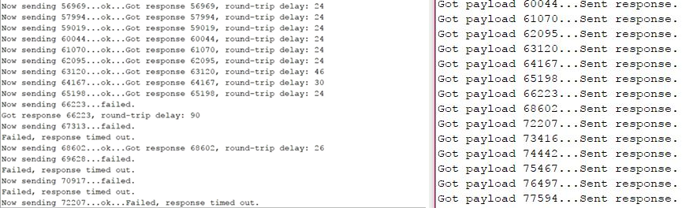
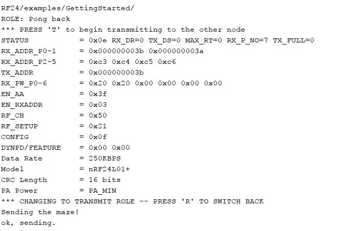
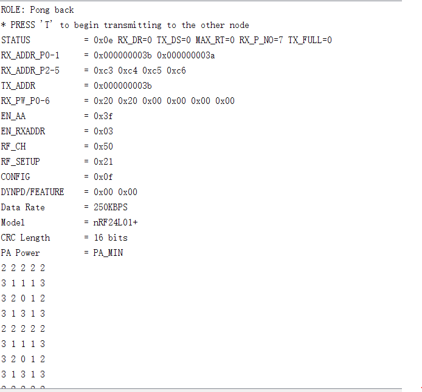
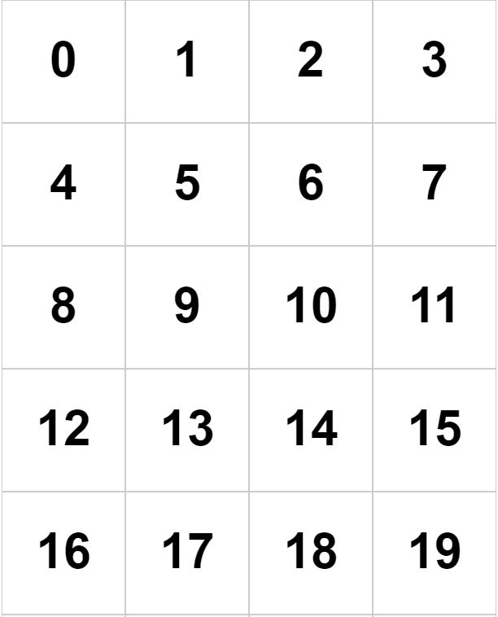
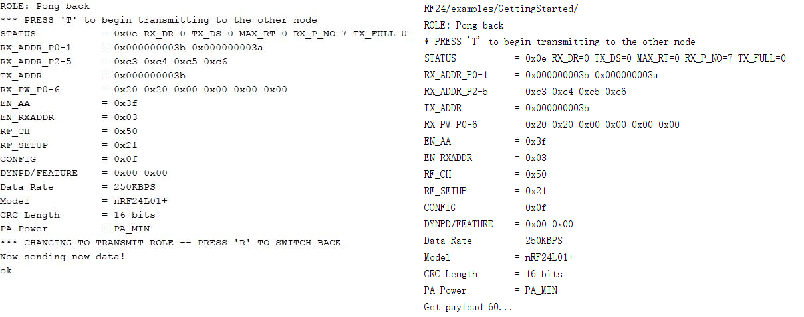
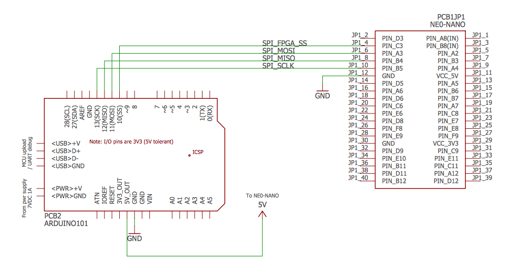

[To Home Page](./index.md)

# Lab 4: FPGA Video Controller and Sound Generation

## Over all Objective: 
Lab 4

## Radio Team:
Yijia Chen, Thinesiya Krishnthasan, Stephanie Lin 

### Objective:
The goal of this lab is to implement the wireless communication between two Arduinos so that they may send and receive the robot’s mapping information. 

### Materials Used:
* 2 Nordic nRF24L01+ transceivers
* 2 Arduino Unos (one must be shared with the other sub-team)
* 2 USB A/B cables
* 2 radio breakout boards with headers

### Prelab:
First, we downloaded the RF34 Arduino library and added it to our Arduino library directory. After downloading the Getting Started code from the Lab 4 webpage and replacing the example in the RF 24 library, we modified it to test out our radios and become familiar with the library. We changed the identifier numbers by using the formula 2(3D+N)+X, where D = 4 (Friday lab), N = 17 (team number), and X = 0, 1 for our two radios. We changed the channel numbers to 3A and 3B, implemented in the following code:

```arduino 
const uint64_t pipes[2] = { 0x000000002ALL, 0x000000002BLL };
```

We then programmed both Arduino boards with the Getting Started example, plugged them into two different laptops, and selected one board to be the transmitter by entering “T” into the serial monitor. Below is a screenshot of what we saw on each monitor. The left side is from the transmitter and the right side is the response. We received regular outputs for successfully sent and received signals. Then, we examined the effect of moving the radios far from one another. We then noticed that the sending failed (see that the screen on the right does not show payload 67313 at all) and that the failures that didn’t time out would return with an exceptionally long round-trip delay.



### Sending an entire maze:

Next, we modified the code to send the maze as a single packet. We defined the maze to be a 4x5 array of unsigned chars. 

#### Defining the maze —

```arduino 
unsigned char maze[4][5] =
{
	2, 2, 2, 2, 2,
	3, 1, 1, 1, 3,
	3, 2, 0, 1, 2,
	3, 1, 3, 1, 3,
}; 
```

#### Modified code for the transmitting end —

```arduino  
if (role == role_ping_out)
{
	// First, stop listening so we can talk.
	radio.stopListening();

	// NOTE: the maze array is defined here

	// Send the maze in a single payload
	printf("Sending the maze!\n");
	bool ok = radio.write( maze, sizeof(maze) );

	if (ok)
		printf("ok, sending. \n");
	else
		printf("failed.\n\r");

	// Now, continue listening
	radio.startListening();

	// Try again 1s later
	delay(1000);
} 
```

*Note: the maze array is also defined in this section.*


#### Modified code for receiving end —

```arduino
if ( role == role_pong_back )
{
	// if there is data ready
	if ( radio.available() )
	{
		// Dump the payloads until we've gotten everything
		unsigned char got_maze[4][5];
		bool done = false;
		while (!done)
		{
			// Fetch the payload, and see if this was the last one.
			done = radio.read( got_maze, sizeof(got_maze) );

			// Spew it
			for (int i=0 ; i<4 ; i++){
				for (int j=0 ; j<5 ; j++){
					printf ("%d ", got_maze[i][j]);
				}
				printf ("\n");
			}

			// Delay just a little bit to let the other unit
			// make the transition to receiver
			delay(20);
		}
	}
}
```

The serial monitors display as we expect them to. The transmitting side sends the payload, and the second Arduino receives and displays the matrix.

*Transmitting:*



*Receiving:*



*Note: The RFK library has an Auto-ACK feature.*

### Sending New Data:

We then modified the code to send new data. We sent 3 pieces of information: a 1-bit indicator, a 2-bit (cardinal) direction, and a 5-bit position coordinate. The indicator is for any extraneous information (i.e. treasures, walls) to be implemented in a suitable fashion in the future. If it turns out that this doesn’t work out well, our code can be easily modified to change the number of bits and the meaning of the indicator. The 2-bit direction denotes which way the robot is facing: North, South, East, or West. (Corresponding binary numbers to be assigned later when code is combined). Finally, the 5-bit position coordinate represents which cell the robot is in. Since the maze is a 4x5 grid, there are 20 boxes, and thus we need 5 bits. We will coordinate the position numbers as follows:



For the transmitter, we packed the bits by using a left shift and sent the package as a single payload.

#### Transmitter side code —

```arduino
if (role == role_ping_out)
{
	// First, stop listening so we can talk.
	radio.stopListening();


	// Define data.
	unsigned char new_data;
	// pack bits as follows:
	// indicator | direction (N/S/E/W) | position (cell 0 - 19)
	// 1 bit | 2 bits | 5 bits

		// test
	unsigned char ind = 0;  // indicator
	unsigned char dir = 3;  // direction
	unsigned char pos = 12; // robot position

	// shift bits in order to pack bits, then or them together
	new_data = ind << 6 | dir << 4 | pos;
	// (0,3,12) should give 0111100 or 60 in decimal

	// Send maze in single payload
	printf("Now sending new data!\n");
	bool ok = radio.write(&new_data, sizeof(unsigned char) );

	if (ok)
		printf("ok\n");
	else
		printf("failed.\n\r");

	// Now, continue listening
	radio.startListening();
}
```

The receiver side unpacks the bits.

#### Receiver side code —

```arduino
if ( role == role_pong_back )
{
	// if there is data ready
	if ( radio.available() )
	{
		unsigned char got_data;
		bool done = false;
		while (!done)
		{
			// Fetch the payload, and see if this was the last one.
			done = radio.read(&got_data, sizeof(unsigned char) );

		    	// Spew it
			printf("Got payload %d...\n",got_data); // display decimal

			// Delay just a little bit to let the other unit
			// make the transition to receiver
			delay(20);
		}
	}
}	
```

The serial monitor displayed as expected. We sent and received a payload of value 60 (00111100). Our results are pictured below. The left side is the transmitter screen, and the right side is the receiver screen.



## FPGA Team:
Peter Slater, Mira Bhut, Yirong Alan

### Objective:

In the final design, we need to send back information about the vehicle location and the maze situation from the Arduino on the car to the base station in order to draw the maze. The maze is drawn by the FPGA, while the information is wirelessly transferred by the Arduino. Hence, we need to communicate between the Arduino and the FPGA through SPI.
 
### Hardware setup:



*Note:  For all the signal sent from Arduino (5v) to FPGA (3.3v), it needs to go through a voltage divider.*


So basically, the Arduino here is the master while the FPGA is the slave. The data is sent from the Arduino to the FPGA to let it know the maze situation and draw it. We use a 8-bit data to represent the vehicle’s location in the maze:
 
Indicator (for future use) | direction of the robot (N/S/E/W) | position (cell 0 – 19)
1 bit          	           | 2 bits (4 states)        	      | 5 bits

### Sending out data from Arduino:
 
The following Arduino code is to send a testing data out from Arduino (the testing data is 01101100, i.e. (0,3,12)):
 
```arduino 
#include "SPI.h" // necessary library
int ss=10; // using digital pin 10 for SPI slave select
int del=200; // used for various delays
 
void setup()
{
  Serial.begin(9600);
  pinMode(ss, OUTPUT); // we use this for SS pin
  SPI.begin(); // wake up the SPI bus.
  SPI.setBitOrder(MSBFIRST);
  // our MCP4162 requires data to be sent MSB (most significant byte) first
}
 
void setValue(int value)
{
  digitalWrite(ss, LOW);
  SPI.transfer(0); // send command byte
  SPI.transfer(value); // send value (0~255)
  digitalWrite(ss, HIGH);
}
 
void loop()
{
  unsigned char new_data;
  	// pack bits as follows:
  	// indicator | direction (N/S/E/W) | position (cell 0 - 19)
  	// 1 bit | 2 bits | 5 bits
	
  	// test
  	unsigned char ind = 0;
  	unsigned char dir = 3;
  	unsigned char pos = 12;
	
  	// shift bits in order to pack bits, then or them together
  	new_data = ind << 7 | dir << 5 | pos;
  	// (0,3,12) should give 01101100 or 60 in decimal
  	Serial.println (new_data);
      setValue(new_data);
  	
}
```
 
 
### Receiving data at FPGA:
 
To receive the data at FPGA, we need a new module SPI:

```verilog 
module SPI (input sck, input mosi, input cs, output reg MAP);
  	reg [159:0] MAP;
  	reg [159:0] tmap;
  	reg [7:0] idx;
  	
  	initial begin
        	MAP <= 160'd0;
        	tmap <= 160'd0;
        	idx <= 8'd0;
        	end
  	
  	always @ (negedge cs) begin
        	idx <= 8'd0;
  	end
        	
  	always @ (posedge sck) begin
        	tmap[idx] <= mosi;
        	idx <= idx + 1;
  	end
  	
  	always @ (posedge cs) begin
        	MAP <= tmap;
  	end
  	
  	endmodule
```
 
When the cs (chip selected) goes down, the FPGA starts to receive data from the most line per positive clock cycle. For each cycle, the FPGA will receive a 8-bit data and stored it in MAP. Eventually the MAP will consist of 20 8-bit data for the robot being in all the positions in the maze, having a length of 160 bits and storing all the information of the vehicle when it is in the maze.


[To Home Page](./index.md)
