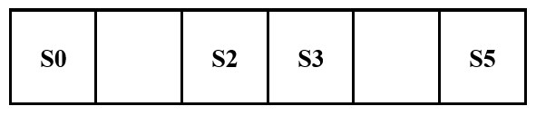

[To Home Page](./index.md)

# Milestone 1

## Hardware Implementation(picture & circuit):


## Following a line:
### First step: 
We want the car to move following the black line.
 
### The Big Idea:  
We plan to use 4 sensors to detect the black line. Right middle two of them are responsible for detecting the black line on the way, to make sure it is moving. The left one and the right one are responsible for detecting the turning junction. Then send further instruction to the servos. We develop a logic to adjust its direction.

### Preparation:

#### 1.     Check all sensors to make sure they work.
We connect sensor and Arduino, used a paper to block the light in front of a certain sensor, and find that the parameter changes. When it detects black tape, the value goes high, because the tape will reflect light. When it detects white, the value goes low.
 
 #### 2.     Develop the control algorithm
The key in this logic is to make sure the car will automatically change its moving direction slightly so that it can move on line.

 

* If S2 sees white and S3 sees black, adjust right;
(the left sensor moves faster)
* If S3 sees white and S2 sees white, adjust left;
(the right sensor moves faster)
* If S2 and S3 both sees black, move forward;
(the right and the left sensor move in the same speed)

#### 3.     Based on the work done in number 2, we successfully made the car follow the line

* Video of the Robot following a strainght black line: 

<iframe width="560" height="315" src="https://www.youtube.com/embed/-5cJnf9C_Cc" frameborder="0" allowfullscreen></iframe>

* Video of the Robot following a curved black line: 

<iframe width="560" height="315" src="https://www.youtube.com/embed/QfTaJXfL2IU" frameborder="0" allowfullscreen></iframe>

The code is as follow:
``` 
#include <Servo.h>

// instantiate the 2 servos
Servo servoL;
Servo servoR;

// instantiate the 2 IR sensors
int s2 = A2;
int s3 = A3;
 
int val2;
int val3;
 
void setup(){
  Serial.begin(9600);
  servoL.attach(10);
  servoR.attach(11);
}
 
void loop(){
  // read in values from sensors
  val2 = analogRead(s2);
  val3 = analogRead(s3);
 
  if ((val2>500)&&(val3>500)){ // if both sensors are on Black
    // move forward
	  servoL.write(120);
	  servoR.write(60);
  }
  else if ((val3<500)){ // if s3 is on White
    // turn Right
	  servoL.write(90);
	  servoR.write(60);
  }
  else if((val2<500)){ // if s2 is on White 
    // turn Left
	  servoL.write(120);
	  servoR.write(90);
  }
  else{ 
    // stop
	  servoL.write(90);
	  servoR.write(90);
  } 
}
```


8:
<iframe width="560" height="315" src="https://www.youtube.com/embed/XdLqsoAvZ2k" frameborder="0" allowfullscreen></iframe>

[To Home Page](./index.md)
