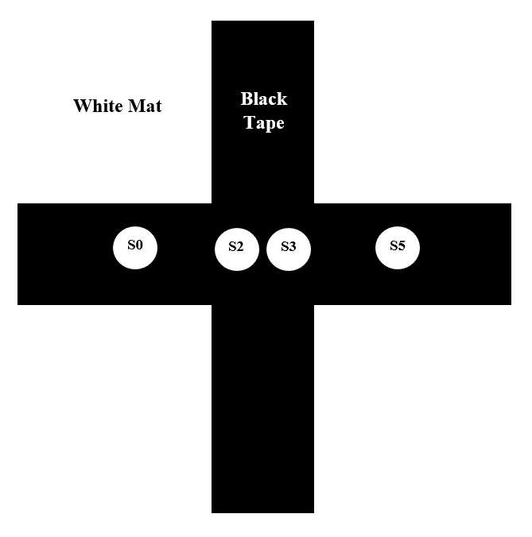
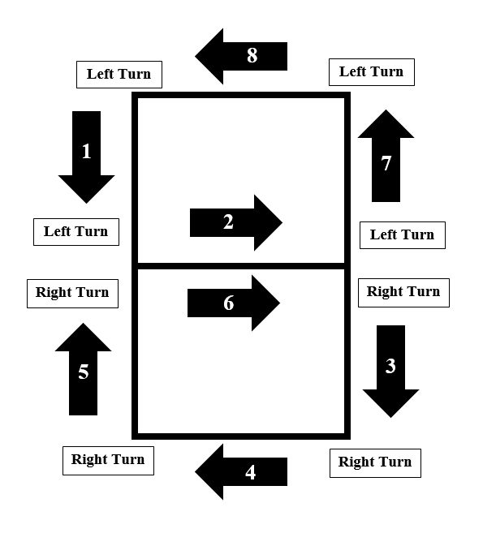

[To Home Page](./index.md)

# Milestone 1

## Hardware Implementation(picture & circuit):


## Following a line:
### First step: 
We want the car to move following the black line.
 
### The Big Idea:  
We plan to use 4 sensors to detect the black line. Right middle two of them are responsible for detecting the black line on the way, to make sure it is moving. The left one and the right one are responsible for detecting the turning junction. Then send further instruction to the servos. We develop a logic to adjust its direction.

### Preparation:

#### 1.     Check all sensors to make sure they work.
We connect sensor and Arduino, used a paper to block the light in front of a certain sensor, and find that the parameter changes. When it detects black tape, the value goes high, because the tape will reflect light. When it detects white, the value goes low.
 
 #### 2.     Develop the control algorithm
The key in this logic is to make sure the car will automatically change its moving direction slightly so that it can move on line.

 

* If S2 sees white and S3 sees black, adjust right;
(the left sensor moves faster)
* If S3 sees white and S2 sees white, adjust left;
(the right sensor moves faster)
* If S2 and S3 both sees black, move forward;
(the right and the left sensor move in the same speed)

#### 3.     Based on the work done in number 2, we successfully made the car follow the line

* Video of the Robot following a strainght black line: 

<iframe width="560" height="315" src="https://www.youtube.com/embed/-5cJnf9C_Cc" frameborder="0" allowfullscreen></iframe>


* Video of the Robot following a curved black line: 

<iframe width="560" height="315" src="https://www.youtube.com/embed/QfTaJXfL2IU" frameborder="0" allowfullscreen></iframe>


The code is as follow:
``` 
#include <Servo.h>
// instantiate the 2 servos
Servo servoL;
Servo servoR;

// instantiate the 2 IR sensors
int s2 = A2;
int s3 = A3;
 
int val2;
int val3;
 
void setup(){
  Serial.begin(9600);
  servoL.attach(10);
  servoR.attach(11);
}
 
void loop(){
  // read in values from sensors
  val2 = analogRead(s2);
  val3 = analogRead(s3);
 
  if ((val2>500)&&(val3>500)){ // if both sensors are on Black
    // move forward
	  servoL.write(120);
	  servoR.write(60);
  }
  else if ((val3<500)){ // if s3 is on White
    // turn Right
	  servoL.write(90);
	  servoR.write(60);
  }
  else if((val2<500)){ // if s2 is on White 
    // turn Left
	  servoL.write(120);
	  servoR.write(90);
  }
  else{ 
    // stop
	  servoL.write(90);
	  servoR.write(90);
  } 
}
```

## Driving in a figure 8:

### Basic sub-routines for driving in a figure 8:
 
#### 1.     Crossline detection:
 
For the grid paths on which our robot moves, the robot would turn 90 degrees at the crossline point to draw a figure 8. Hence how to detect the place to turn is the first fundamental sub-routine we need design. When the robot comes across a crossline, all of the sensors lined up at the bottom of the robot will be on the black tapes. That is to say, if all sensors have a very high input value, we make the robot start to rotate.

 


#### 2.     Turning 90 degrees: 

<iframe width="560" height="315" src="https://www.youtube.com/embed/Wm7HhTSVdLU" frameborder="0" allowfullscreen></iframe>
 
To make the robot turn 90 degrees, we basically use the delay method. We make the two wheels turn in opposite direction for a small amount of time to rotate the robot for a certain angle. The rotating time is controlled by the time we delay, and according to our experiments, the robot will rotate 90 degrees when we delay 800 ms.

#### 3.     Moving in figure-8 pattern:
 
<iframe width="560" height="315" src="https://www.youtube.com/embed/XdLqsoAvZ2k" frameborder="0" allowfullscreen></iframe> 
 
The robot will move in a figure 8 if we make the turning direction in a loop shown below:

 

That is :
 
1 -> L
2 -> L
3 -> R
4 -> R
5 -> R
6 -> R
7 -> L
8 -> L

Hence, we use a mod function and a counter to help the robot decide which way it should turn (See the detail in the code).
 
 
Code for driving in figure 8:
``` 
#include <Servo.h>
 
Servo servoL;
Servo servoR;
 
int s0 = A0;
int s2 = A2;
int s3 = A3;
int s5 = A5;
 
int val0 ;
int val2 ;
int val3 ;
int val5 ;
 
int thres = 500;
int count = 0;
 
void setup(){
  count = 0;
  Serial.begin(9600);
  servoL.attach(10);
  servoR.attach(11);
  servoL.write(120);
  servoR.write(60);
  delay(800);
}
 
void goForward(){
  servoL.write(120);
  servoR.write(60);
}
 
void turnLeft(){
  servoL.write(120);
  servoR.write(60);
 
  delay(100);
  stay();
  servoL.write(0);
  servoR.write(0);
 
  delay(800);
 
  servoL.write(90);
  servoR.write(90);
}
 
void turnRight(){
  servoL.write(120);
  servoR.write(60);
  delay(100);
  stay();
  servoL.write(180);
  servoR.write(180);
 
  delay(800);
 
  servoL.write(90);
  servoR.write(90);
}
 
void stay(){
  servoL.write(90);
  servoR.write(90);
 
 
}
 
 
void followLine(){
  val0 = analogRead(s0);
  val2 = analogRead(s2);
  val3 = analogRead(s3);
  val5 = analogRead(s5);
 
	if ((val2>500)&&(val3>500)){
  	goForward();
	}
	else if((val3<500 && val2>500)){
      servoL.write(90);
  	servoR.write(60);
	}
	else if((val2<500 && val3>500)){
  	servoL.write(120);
  	servoR.write(90);
	}
	else{
  	stay();
	}
}
 
 
void turn_eight(int count) {
  val0 = analogRead(s0);
  val2 = analogRead(s2);
  val3 = analogRead(s3);
  val5 = analogRead(s5);
  if((count%8 >=2) && (count%8 <=5)) {
  	turnRight();
  	val0 = analogRead(s0);
  	val2 = analogRead(s2);
  	val3 = analogRead(s3);
  	val5 = analogRead(s5);
	
  }
  else {
  	turnLeft();
  	val0 = analogRead(s0);
  	val2 = analogRead(s2);
  	val3 = analogRead(s3);
  	val5 = analogRead(s5);
  }
}
 
void loop(){
 
  val0 = analogRead(s0);
  val2 = analogRead(s2);
  val3 = analogRead(s3);
  val5 = analogRead(s5);
 
  Serial.println(val0);
  if ((val0>thres)&&(val2>thres)&&(val3>thres)&&(val5>thres)){ // at a crosssection
	stay();
	turn_eight(count);
	count = count +1;
  }
  else{
	followLine();
  }
}  
```


[To Home Page](./index.md)
