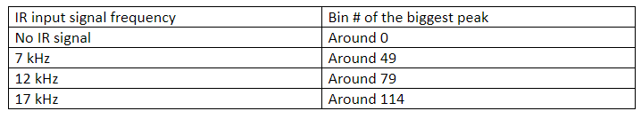
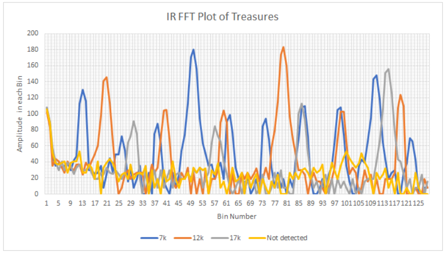

[To Home Page](./index.md)

# Milestone2

## Objective:


## Treasure detection:

Based on the FFT library of Arduino, we developed a code that could generate “frequency spectrums” of IR signal inputs of different frequencies.

Using the Excel, we plotted the spectrum, which is essentially a distribution over 128 FFT bins. (There are 256 bins in total, but only 128 of them stores the real value) From the distribution graph we could see that IR signal with different frequencies has different peak value locations:





Based on the distribution, we could set thresholds in between to identify 7, 12, and 17 kHz IR signals. Considering the accuracy of the categorization, we set the threshold in the middle of the two biggest peak bin #:

* The threshold between no-detection and 7kHz is 20.
* The threshold between 7kHz and 12kHz is 64.
* The threshold between 12kHz and 17kHz is 97.

### The code for treasure-detection:
```
#define LOG_OUT 1 // use the log output function
#define FFT_N 256 // set to 256 point fft

#include <FFT.h> // include the library

void setup() {
  Serial.begin(115200); // use the serial port
  TIMSK0 = 0; // turn off timer0 for lower jitter
  ADCSRA = 0xe5; // set the adc to free running mode
  ADMUX = 0x40; // use adc0
  DIDR0 = 0x01; // turn off the digital input for adc0
}

void loop() {
  while(1) { // reduces jitter
    cli();  // UDRE interrupt slows this way down on arduino1.0
    for (int i = 0 ; i < 512 ; i += 2) { // save 256 samples
      while(!(ADCSRA & 0x10)); // wait for adc to be ready
      ADCSRA = 0xf5; // restart adc
      byte m = ADCL; // fetch adc data
      byte j = ADCH;
      int k = (j << 8) | m; // form into an int
      k -= 0x0200; // form into a signed int
      k <<= 6; // form into a 16b signed int
      fft_input[i] = k; // put real data into even bins
      fft_input[i+1] = 0; // set odd bins to 0
    }
    fft_window(); // window the data for better frequency response
    fft_reorder(); // reorder the data before doing the fft
    fft_run(); // process the data in the fft
    fft_mag_log(); // take the output of the fft
    sei();
    
    int maximum = fft_log_out[0];
    int index = 0;
    int N = FFT_N/2;
    int average = maximum/N;
    for (byte i = 1 ; i < N ; i++) { 
      int val = fft_log_out[i]; 
      if(val>= maximum){
        index = i; 
        maximum = val;
      }
      average += val/N; 
    }
    int prom = maximum/average; 
    Serial.println(index);
    if(index <= 20){
      Serial.println("Not detected"); 
    }
    else if(index <= 64){
      Serial.println("7k");
    }
    else if(index <= 97){
      Serial.println("12k");
    }
    else {
      Serial.println("17k");
    }
    delay(100);
  }}
```

## Wall detection:

For the distance sensor, we’re using the VL53L0X Time-of-Flight Distance Sensor. 

### Pinout:


[To Home Page](./index.md)
