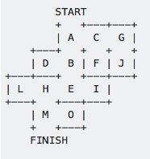
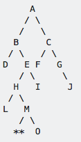

[To Home Page](./index.md)

# Milestone3

## Objective:


## In Simulation:

We are using the DFS (Depth First Search) method to solve the maze. For any maze the robot is searching through, we could treat the maze as a tree structure with the top node as the starting point and one leaf node as the exit (ending point). Then, by applying Depth-First Searching recursion algorithm, we could lead the robot searching through the maze.

For example, with the maze given below:



We could represent the maze as the tree given below:




( ** represent the finishing the maze)

While depth-first searching the maze (in-order traverse with backtracking), we would get the robot moving path as below:

A B D (backtrack) E H L (backtrack) M ** 


We tried out our algorithum in matlab and use the simulation given by Professor Bruce Land.  We split the simulation to funtions like:
* collectSensorInformation.m = Outputs the information from the three wall sensors (left, front, and right wall sensors)
* dfs.m = traces the maze recursively. At each grid point the robot collects information about all it's neighbors which will help it decide whether any of the neigbors are a wall or a path to trace. If it reaches a deadend, the robot will trace back to the last time it reached an intersection with multiple options to go down (a fork in the rode).  It prints out Done! when it has mapped out the entire maze.

The vedio below shows that the simulation: 

 <iframe width="560" height="315" src="https://www.youtube.com/embed/Ljgl3WTfQXA" frameborder="0" gesture="media" allowfullscreen></iframe>


## In Real Life:

### Line & Wall sensors:

We’re using 4 line sensors (product #) to let the robot go straight along the black tape and detecting the cross section. The most implementation of this part will be the same as what we did in milestone 1 and 2. For the extra requirement of milestone 3, we will treat each cross section we detected as a decision-making place where the robot will collect the information from the three wall detectors and to decide which way it will keep going based on the DFS algorithm.

The wall detectors we’re using are VL53L0X () sensors, which could detect the distance between the sensor and objects in front at a very accurate level. The sensors need I2C interface for data transmission between itself and the Arduino. Also for multiple usage for the sensor (we are using three of them in total), we cannot activate them simultaneously and have to alternate between the sensors. 

To alternate between sensors to get all wall information, we will assign each sensor a unique address via a XSHUT pin. The Arduino code for alternating multiple wall sensors is below (we were alternating between two wall sensors in the test code):

```arduino

#include "Adafruit_VL53L0X.h"

Adafruit_VL53L0X lox = Adafruit_VL53L0X();
int counter;

void setup() {
  Serial.begin(115200);
  // wait until serial port opens for native USB devices
  while (! Serial) {
    delay(1);
  }
  
  Serial.println("Adafruit VL53L0X test");
  /*
  if (!lox.begin()) {
    Serial.println(F("Failed to boot VL53L0X"));
    while(1);
  }
  */
  // power
  digitalWrite(8,LOW);
  digitalWrite(9,LOW);
  delay(10);
  digitalWrite(8,HIGH);
  digitalWrite(9,HIGH);
  digitalWrite(9,LOW); 
  lox.begin(0x30);
  digitalWrite(9,HIGH);
  lox.begin(0x31);
  Serial.println(F("VL53L0X API Simple Ranging example\n\n"));

}


void loop() {
  digitalWrite(9,LOW);
  digitalWrite(8,HIGH);
  counter = 0;
  while(counter <= 10){
    detect1();
    counter = counter + 1;
  }
  counter = 0;
  digitalWrite(9,HIGH);
  digitalWrite(8,LOW);
  //lox.begin(0x31);
  
  while(counter <= 10){
    detect2();
    counter = counter + 1;
  }
  
}

void detect1() {
  VL53L0X_RangingMeasurementData_t measure;
    
  Serial.print("Reading a measurement... ");
  lox.rangingTest(&measure, false); // pass in 'true' to get debug data printout!

  if (measure.RangeStatus != 4) {  // phase failures have incorrect data
    Serial.print("Distance(1) (mm): "); Serial.println(measure.RangeMilliMeter);
  } 
  else {
    Serial.println(" out of range ");
  }
   
  delay(100);

}

void detect2() {
  VL53L0X_RangingMeasurementData_t measure;
    
  Serial.print("Reading a measurement... ");
  lox.rangingTest(&measure, false); // pass in 'true' to get debug data printout!

  if (measure.RangeStatus != 4) {  // phase failures have incorrect data
    Serial.print("Distance(2) (mm): "); Serial.println(measure.RangeMilliMeter);
  } 
  else {
    Serial.println(" out of range ");
  }
   
  delay(100);

} 
```


## To do list:

* Work out the motor and IMU
* Integrate Radio & SPI transmission (data for maze drawing)
* Draw the Maze based on the data transmitted


[To Home Page](./index.md)
