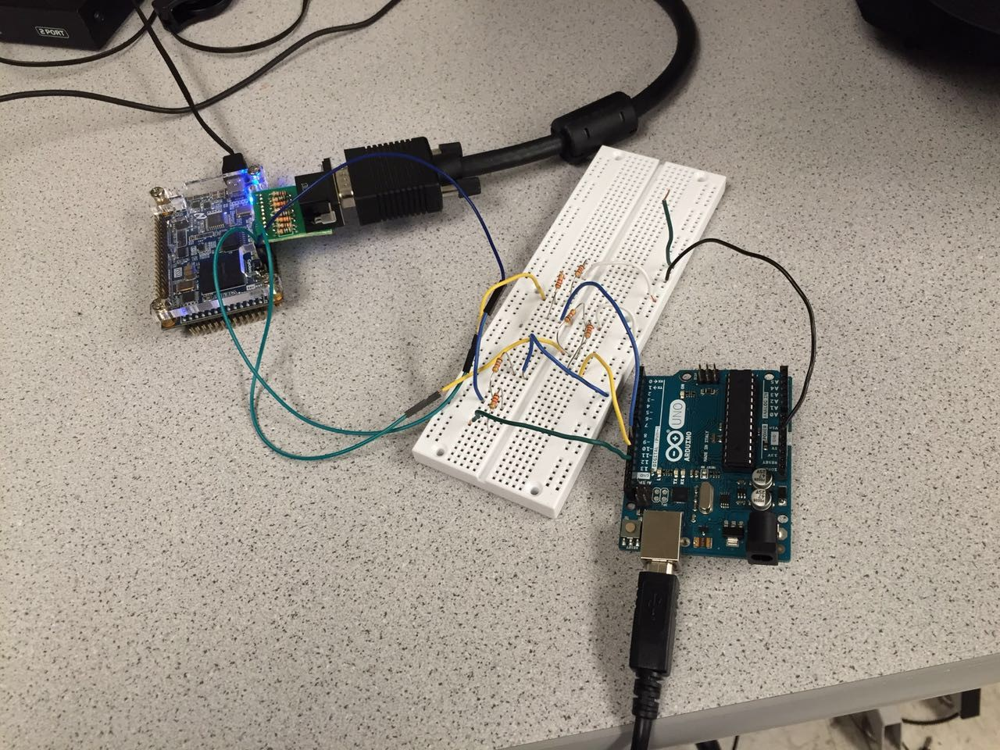

[To Home Page](./index.md)

# Milestone4

## Objective:
The goal of this milestone was to have robot map the maze as it traverses it, as well as indicate the location of the treasures found.

## Current overall progress:
 
Rebuilt the robot:
We planned to use a motor with IMU and encoder to replace the servo for our final design. However, the H bridge of the L298N motor controller does not work and the motor could only spin in one direction. As a result, we have to change our motor back to servo, which caused some extra work and made our progress a little bit behind. 
 
We basically have all the separate parts work now for the final competition, and we may need some further working time to implement all of these together

What we have now:
 
1. The robot searching through the maze with algorithm while also sending data to base station’s Arduino for maze drawing.
2. The radio communication code to transmit data wirelessly between two Arduino.
3. The SPI transmission interface to transmit the robot’s state data from Arduino to FPGA.
4. The Verilog code to draw the maze blocks with different color based on the whether the block is a path, wall, or treasure.


## Work Distribution For Milestone 4:
*  Robot Algorithm: Thinesiya & Alan
* Radio: Yijia & Stephane
* SPI: Alan & Yijia
* VGA Maze Drawing: Peter

## Implementing Robot Algorithm in Real Life
We had a MATLAB script from Milestone 3 which allowed us to test out our maze navigating algorithm before implementing it in Arduino and incorporating our robot.  We started off with a simple follow the left wall algorithm.  

### Follow the Left Wall:

#### Void Functions
* Follow Line: Uses our middle two of the four line sensors to guide the robot along the black line
* Turn Left: turn 90 degrees left
* Turn Right: turn 90 degrees right
* U Turn: turn 180 degrees

#### Boolean Functions 
* Is there a Left wall?
* Is there a Front wall?
* Is there a Right wall?
* Is it at a crossroad (intersection)?

### Our logic was as follows:
If (robot is at a crossroads):
	If (there is no Left Wall):
		Turn left and follow line
	Else:
		If (there is no Front Wall):
			Follow line
Else:
	If (there is no Right Wall):
		Turn right and follow line
	Else:
		Make a U Turn

### Arduino Script 

```arduino
#include <Servo.h>

// instantiate the 2 servos
Servo servoL;
Servo servoR;


int lineS0 = A0; // Line Sensor0 (Left)
int lineS2 = A1; // Line Sensor1 (Center Left)
int lineS3 = A2; // Line Sensor2 (Center Right)
int lineS5 = A3; // Line Sensor3 (Right)
int lineSThres = 500;

int leftWall = A6;// Left Wall Sensor
int frontWall = A4;// Front Wall Sensor
int rightWall = A5;// Right Wall Sensor

void setup() {
  // put your setup code here, to run once:
  Serial.begin(9600);
  servoL.attach(10);
  servoR.attach(11);
  
}

void loop() {

  
  bool cross = atCrossRoad();
  if (cross){
      servoL.write(90);
  servoR.write(90);
  delay(500);
    decisionAtCross();
  }
  else{
    followLine();
  }  

}

void decisionAtCross(){
  bool decLeft = detectLeftWall();
  bool decFront = detectFrontWall();
  bool decRight = detectRightWall();
  
  if (!decLeft){
    Serial.println("here1");
   turnLeft();
   followLine();
  }
  else{
    if(!decFront){
      Serial.println("here2");
      followLine();
    }
    else{
      if (!decRight){
        Serial.println("here3");
        turnRight();
        followLine();
      }
      else{
        Serial.println("here4");
        turnU();
        followLine();
      }
    }
  }
}


bool atCrossRoad(){
  int val_lineS0= analogRead(lineS0);
  int val_lineS5= analogRead(lineS5);
  if((val_lineS0>lineSThres)&&(val_lineS5 >lineSThres)){
    return true; 
  }
  else{
    return false;
  }
}

// Follow Line
void followLine(){  
// read in values from sensors
  int val2= analogRead(lineS2);
  int val3= analogRead(lineS3);

  // if both sensors are on Black 
  if ((val2>550)&&(val3>550)){ 
    // move forward
    servoL.write(80);
    servoR.write(100);
  }
  
  // if s3 is on White
  else if ((val2<550)){ 
    // turn Right
    servoL.write(90);
    servoR.write(100);
//    servoL.write(90);
//    servoR.write(90);
  }
  
  // if s2 is on White
  else if((val3<550)){  
    // turn Left
    servoL.write(80);
    servoR.write(90);
//    servoL.write(90);
//    servoR.write(90);
  }
  
  else{ 
    // stop
    servoL.write(90);
    servoR.write(90);
  } 
  
}


// Turn Left
void turnLeft() {
  servoL.write(90);
  servoR.write(90);
  delay(500);
  servoL.write(60);
  servoR.write(120);
  delay(250);
  servoL.write(0);
  servoR.write(0);
  delay(800);
  servoL.write(90);
  servoR.write(90);
}

// Turn Right
void turnRight() {
    servoL.write(90);
  servoR.write(90);
  delay(500);
  servoL.write(60);
  servoR.write(120);
  delay(250);
  servoL.write(180);
  servoR.write(180);
  delay(800);
  servoL.write(90);
  servoR.write(90);
}

void turnU() {
  servoL.write(90);
  servoR.write(90);
  delay(180);
  servoL.write(0);
  servoR.write(0);
  delay(1600);
  servoL.write(90);
  servoR.write(90);
}

bool detectLeftWall() {
  float wallsensorValue = analogRead(leftWall)*0.0048828125;;
  int distance = 13*pow(wallsensorValue, -1);
  if(distance <= 25){ // wall detected on the left
    return true;
  }
  else{
    return false;
  }    
}

bool detectFrontWall() {
  float wallsensorValue = analogRead(frontWall)*0.0048828125;;
  int distance = 13*pow(wallsensorValue, -1);
  if(distance <= 20){ // wall detected on the front
    return true;
  }
  else{
    return false;
  } 
}

bool detectRightWall() {
  float wallsensorValue = analogRead(rightWall)*0.0048828125;;
  int distance = 13*pow(wallsensorValue, -1);
  if(distance <= 25){ // wall detected on the right
    return true;
  }
  else{
    return false;
  }
}
```

### Video of Navigating Maze:
<iframe width="560" height="315" src="https://www.youtube.com/embed/tjmL9FE6jz0" frameborder="0" gesture="media" allowfullscreen></iframe>

### DFS:
 We also started implementing the DFS algorithm in Arduino. But ran into trouble using recursion. This is what we want to work on next.

### Package format that the Robot sends the Base Station:

#### Package1:Maze Mapping Informaition
|indicator:0 |indicator:0|orientation|orientation|x-corrdinate|x-corrdinate|x-corrdinate|x-corrdinate|
|---|---|---|---|---|---|---|---|

#### Package2: Maze Mapping Information
|indicator:1 |1=if there is a left wall |1=if there is a front wall |1=if there is a right wall |y-corrdinate|y-corrdinate|y-corrdinate|y-corrdinate|
|---|---|---|---|---|---|---|---|

#### Package3: Treasure Information
|indicator:0 |indicator:1|1=if there is treasure on left wall |1=if there is treasure on  front wall |1=if there is treasure on right wall |1= if 7kHz treasure|1= if 12kHz treasure|1= if 17kHz treasure|
|---|---|---|---|---|---|---|---|

#### Package4: Done Signal
|indicator:0 |indicator:1|1|1|1|1|1|1|
|---|---|---|---|---|---|---|---|


## Radio
The radio portion of the robot is almost the same as in Lab 3, except since we did not actually take apart our 8-bit string, we did it here instead. In addition, we came up with a new syntax with indicators to delineate what type of information is being sent in the 8-bit string.
We divided the data into two package. To decode the 8-bit data, we use the AND with 10000000 to extract the most significant bit, if it is package 1, then we continue to use AND to get the orientation and the x-cord, if it is package 2, then we can get the data of three wall treasures and y-cord.

Below is a test video, we manually set the the wall and the position, it shows that two arduino can transmit the data successfully.


## SPI

After the data was transmitted to the base station’s Arduino, we need a SPI transmission interface for the FPGA to read in the data and knows where the robot is and what is around it.
 
There are 3 outputs from the Arduino: clock (sck) from pin 13; master out slave in (mosi) from pin 11, and chip select (ss) from pin 10.
 
With a voltage divider (5v to 3.3v) in between, we connect sck with GPIO_0_D[28], mosi with GPIO_0_D[24], and ss with GPIO_0_D[26].



We would use the Arduino to send data with the SPI library with the following function:
```arduino 
void setValue(int value)
{
  digitalWrite(ss, LOW);
  //SPI.transfer(0); // send command byte
  SPI.transfer(value); // send value (0~255)
  digitalWrite(ss, HIGH);
  SPI.setClockDivider(SPI_CLOCK_DIV128);
}
``` 
with the value being the decimal value of the 8-bit data we’re transmitting per time.
 
On the FPGA side,  we read in the data using the following code:

```verilog 
reg [7:0]  data_receive;
reg [7:0]  data;
wire        ss;
reg [2:0]  idx;
wire [7:0] arduino_clk;
 
assign ss = GPIO_0_D[26];
assign arduino_clk = GPIO_0_D[28];
 
initial begin
  	idx = 0;
  	end
 
always @ (negedge ss) begin
  	    idx <= 0;
        	  data <= 0;
        	  data_receive <= 0;
  	end
 
 
always @ (posedge arduino_clk) begin
  	     
        	  data[idx] <= GPIO_0_D[24];
        	  if(idx<=6)
        	  idx <= idx + 3'b1;
        	  else
        	  idx <= 3'b0;
        	 
        	 
  	end
  	 
always @ (posedge ss) begin
  	 
  	    data_receive <= data;
        	 
        	 
 
  	end
``` 
 
Testing with Arduino sending data from 0 to 255 and show the data received by the leds on fpga board:
 
<iframe width="560" height="315" src="https://www.youtube.com/embed/67jhrgAChC4" frameborder="0" gesture="media" allowfullscreen></iframe>


## VGA Maze Drawing

To draw the maze on the screen, we basically use if-else statement in verilog to assign different area into part. We divide the screen into wall parts(north, east , west, south) and corner parts(northwest, northeast, southwest, southeast)  we build two modules in verilog so that the last low can show the colored square sequentially. 

```verilog
if(X >= (`X_SIZE*10'd0 + `X_OFFSET) && X < (`X_SIZE*(10'd0+10'd1) + `X_OFFSET) && Y >= (`Y_SIZE*10'd0 + `Y_OFFSET) && Y < (`Y_SIZE*(10'd0+10'd1) + `Y_OFFSET))
		begin 
			XOFF <= (`X_SIZE*10'd0 + `X_OFFSET);
			YOFF <= (`Y_SIZE*10'd0 + `Y_OFFSET);
			CELL <= MAP[7:0];
			if(rpos == 5'b00000)
				RBT <= {roth,5'b11111};
			else
				RBT <= {roth,5'b00000};
				
		end
…
else
		begin
			XOFF <= 10'b1111111111;
			YOFF <= 10'b1111111111;
			CELL <= 8'b00000000;
			RBT <= 8'b00000000;
		end
	end
	
endmodule


```
```
always @ (posedge CLK)
	begin
		if(XOFF == 10'b1111111111 && YOFF == 10'b1111111111)
		begin
			COL <= `BLACK;
		end
		else if(xrel >= 0 && xrel < `X_SIZE && yrel >= 0 && yrel < `Y_SIZE)
		begin
			// northwest corner
			if(xrel >= `ZERO && xrel < `W_WALL && yrel >= `ZERO && yrel < `N_WALL && `ZERO)
				COL <= `COL_WALL;
			
			// north wall
			else if(xrel >= `W_WALL && xrel < `X_SIZE-`E_WALL && yrel >= `ZERO && yrel < `N_WALL && NORTH)
				COL <= `COL_WALL;
			
			// norhteast corner
			else if(xrel >= `x_SIZE-`E_WALL && xrel < `X_SIZE && yrel >= `ZERO && yrel < `N_WALL && `ZERO)
				COL <= `COL_WALL;
			
			// west wall
			else if(xrel >= `ZERO && xrel < `W_WALL && yrel >= `N_WALL && yrel < `Y_SIZE-`S_WALL && WEST)
				COL <= `COL_WALL;
			
			// east wall
			else if(xrel >= `X_SIZE-`E_WALL && xrel < `X_SIZE && yrel >= `N_WALL && yrel < `Y_SIZE-`S_WALL && EAST)
				COL <= `COL_WALL;
			
			// southeast corner
			else if(xrel >= `ZERO && xrel < `W_WALL && yrel >= `Y_SIZE-`S_WALL && yrel < `Y_SIZE && `ZERO)
				COL <= `COL_WALL;
			
			// south wall
			else if(xrel >= `W_WALL && xrel < `X_SIZE-`E_WALL && yrel >= `Y_SIZE-`S_WALL && yrel < `Y_SIZE && SOUTH)
				COL <= `COL_WALL;
			
			// southwest corner
			else if(xrel >= `X_SIZE-`E_WALL && xrel < `X_SIZE && yrel >= `Y_SIZE-`S_WALL && yrel < `Y_SIZE && `ZERO)
				COL <= `COL_WALL;
			
			// background color
			else
				if(TREASURE == 2'b01)
					COL <= `RED;
				else if(TREASURE == 2'b10)
					COL <= `GREEN;
				else if(TREASURE == 2'b11)
					COL <= `BLUE;
				else if(COLOR == 2'b01)
					COL <= `COL_VIS;
				else if(rcnd)
					COL <= `COL_RBT;
				else
					COL <= `WHITE;
		end
		else
			COL <= `COL_UNDF;
	end
endmodule
```

The following is the vedio of the Monitor displaying the different squares and the walls. The grey squares are blank space the and the colored ones are the ones that contain the treasures.:

<iframe width="560" height="315" src="https://www.youtube.com/embed/wSyzOmto8Sg" frameborder="0" gesture="media" allowfullscreen></iframe>

## Next Step:
We have have the milestone in components and be plan to put all our parts together to get a rea-time update while the Robot navigates the maze.


[To Home Page](./index.md)
